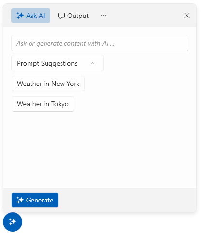

# WPF RadAIPrompt Overview

The AIPrompt component allows you to write prompts and execute predefined commands as well as look and interact with the output from the AI.





>tip Get started with the control with its [Getting Started]() help article that shows how to use it in a basic scenario.

## Key Features

* __Views__&mdash;The component provides different views that you can include in it. This allows the users to have more control over when interacting with the AIPrompt.
* __Prompt button__&mdash;The AIPrompt component provides the ability to display it as a button, which when interacted with, will display the prompt. To learn more about the AIPrompt button, check this [article]().
* __Suggestions__&mdash;This collection will allow you to populate the AIPrompt component with suggestions that will be displayed to the user while typing. Read more about the suggestions feature [here]().
* __Commands__&mdash;The Commands collection gives you the ability to define custom commands and populate them in one of the views of the component. Check this [article]() to learn more about the commands functionality.

> Check out the demos application at [demos.telerik.com](https://demos.telerik.com/wpf/).

## See Also
* [Visual Structure]()
* [Getting Started]()