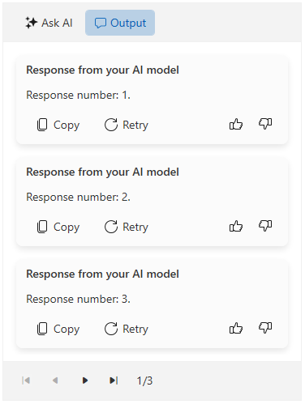

# Paging

The `RadAIPrompt` supports paging on the output items from the output view. To enable this functionality, you can utilize the following properties:

* `IsPagingEnabled`&mdash;Enables or disables the paging functionality.
* `PageSize`&mdash;Gets or sets the size of the page.
* `CurrentPageIndex`&mdash;Gets or sets the current page index.

__Enabling the paging functionality__
```XAML
    <telerik:RadAIPrompt x:Name="aiPrompt" 
                         PromptRequest="OnPromptRequested" 
                         IsPagingEnabled="True"
                         PageSize="3">
        <telerik:RadAIPromptInputItem />
        <telerik:RadAIPromptOutputItem />
    </telerik:RadAIPrompt>
```

__RadAIPrompt with paged data in the output view__

