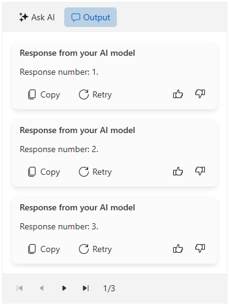

# Paging

The `RadAIPrompt` supports paging on the output items from the output view. To enable this functionality, you can utilize the following properties:

* `IsPagingEnabled`&mdash;Enables or disables the paging functionality.
* `PageSize`&mdash;Gets or sets the size of the page.
* `CurrentPageIndex`&mdash;Gets or sets the current page index.

__Enabling the paging functionality__
<snippet id='radaiprompt-paging-enabling_the_paging_functionality-xaml' />

__RadAIPrompt with paged data in the output view__

