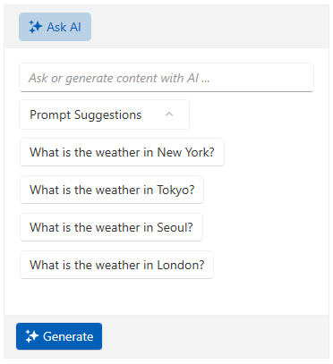
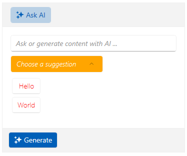

# Suggestions

The `RadAIPrompt` control allows you to define suggestions for the user prior to initiating a request. To do so, set the `AreSuggestionsVisible` property to __True__ of RadAIPrompt and add entries of the type of __string__ to its `Suggestions` collection. The Suggestions property expects a collection that implements the `IEnumerable` interface.

__Showing Suggestions in the RadAIPrompt__
<snippet id='radaiprompt-suggestions-showing_suggestions_in_the_radaiprompt-cs' />

__RadAIPrompt with suggestions__

## Customizing the Appearance of the Suggestions

RadAIPrompt control exposes properties that will allow you to customize the appearance of each suggestion. They are as follows:

* `SuggestionItemTemplate`&mdash;Allows you to set a custom DataTemplate that will be applied to each suggestion.
* `SuggestionHeaderContent`&mdash;Provides the functionality to specify a header for the element that displays the suggestions.
* `SuggestionHeaderContentTemplate`&mdash;Allows you to specify a custom DataTemplate for the header of the element that visualizes the suggestions.
* `SuggestionsExpanderStyle`&mdash;This property lets you set a custom Style for the RadExpander element that displays the suggestions.

The following example showscases the RadAIPrompt when the above properties are used:

__Defining a sample model and a view model__
<snippet id='radaiprompt-suggestions-defining_a_sample_model_and_a_view_model-cs' />

__Defining the RadAIPrompt and its properties__
<snippet id='radaiprompt-suggestions-defining_the_radaiprompt_and_its_properties-xaml' />

__RadAIPrompt suggestions with custom appearance__

## See Also
* [Views]()
* [Events]()
* [RadAIPromptButon]()
* [Commands]()
* [Paging]()