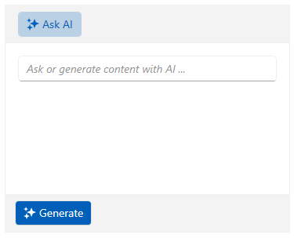
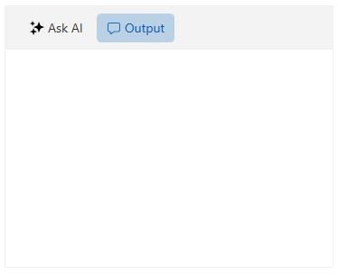
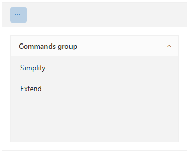
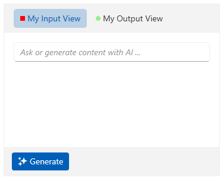

# Views

The `RadAIPrompt` control provides 3 default items that have as their content the dfault views. They will need to be included in its `Items` collection. The control supports only one instance of each view to be defined in this collection.

>important Setting the ItemsSource collection of the RadAIPrompt control is not supported. The Items collection has to be used instead.

## Input view

The input view is represented by the `RadAIPromptInputItem` class. This view contains an input textbox that the user can type their request in. It also displays the custom suggestions defined in the Suggestions collection of the RadAIPrompt control.

>tip For more information on the suggestions feature of the component, check this [article]().

__Adding the input view in the RadAIPrompt__
```XAML
    <telerik:RadAIPrompt>
        <telerik:RadAIPromptInputItem/>
    </telerik:RadAIPrompt>
```

__RadAIPrompt with the input view defined in it__



## Output view

The output view is represented by the `RadAIPromptOutputItem` class and it displays the responses from your AI service. Each response is represented by an `AIPromptOutputItem` element, whose DataContext is the `AIPromptOutputItemModel` class. 

The `AIPromptOutputItemModel` class provides the following properties:

* `Title`&mdash;This property gets or sets the title of the AIPromptOutputItem element.
* `InputText`&mdash;This property gets or sets the input text that end-user has requested and it is displayed by the AIPromptOutputItem element.
* `ResponseText`&mdash;This property gets or sets the response text provided by your AI model that the AIPromptOutputItem will display.
* `Rating`&mdash;This property gets or sets the rating of the end-user for the response returned by your AI model.

>tip Check the [Requesting a Response](#requesting-a-response) section of the Getting Started article of the component's documentation to see how to add a new item in this view.

__Adding the output view in the RadAIPrompt__
```XAML
    <telerik:RadAIPrompt>
        <telerik:RadAIPromptInputItem/>
        <telerik:RadAIPromptOutputItem/>
    </telerik:RadAIPrompt>
```

__RadAIPrompt with the input and output views defined in it__



## Commands View

The commands view is an additional view that will display the commands set to the `Commands` collection of RadAIPrompt. This view is repsented by a `RadAIPromptCommandsItem` class and it displays the Commands collection of the control via a `RadPanelBar` element.

>tip To learn more about the commands functionality of RadAIPrompt, check the [Commands]() documentation article.

__Adding the commands view in the RadAIPrompt__
```XAML
    <telerik:RadAIPrompt Commands="{Binding MyCommandsCollection}">
        <telerik:RadAIPromptCommandsItem/>
    </telerik:RadAIPrompt>
```

__RadAIPrompt with the commands view in the RadAIPrompt__



## Common Properties

Each view that is supported by the RadAIPrompt extends the `RadAIPromptItem` class. This class exposes the following properties that you can set for each view:

* `Icon`&mdash;Gets or sets an icon to the view instance. This property is of the type of __object__.
* `IconTemplate`&mdash;Gets or sets a `DataTemplate`, whose `DataContext` will be the value set to the `Icon` property, for customizing the icon of the view instance.

Additionally, the RadAIPromptItem class derives from the native WPF `HeaderedContentControl` class. The properties that are exposed by it can also be set.

__Customizing the views__
```XAML
    <telerik:RadAIPrompt>
        <telerik:RadAIPromptInputItem Header="My Input View">
            <telerik:RadAIPromptInputItem.IconTemplate>
                <DataTemplate>
                    <Rectangle Width="8" Height="8" Fill="Red"/>
                </DataTemplate>
            </telerik:RadAIPromptInputItem.IconTemplate>
        </telerik:RadAIPromptInputItem>
        <telerik:RadAIPromptOutputItem Header="My Output View">
            <telerik:RadAIPromptOutputItem.IconTemplate>
                <DataTemplate>
                    <Ellipse Width="8" Height="8" Fill="LightGreen"/>
                </DataTemplate>
            </telerik:RadAIPromptOutputItem.IconTemplate>
        </telerik:RadAIPromptOutputItem>
    </telerik:RadAIPrompt>
```

__RadAIPrompt with customized views__



# See Also
* [Commands]()
* [Suggestions]()