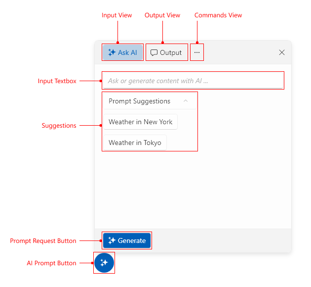
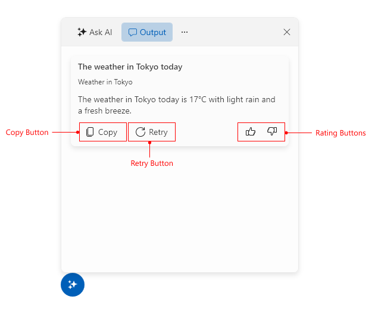

# Visual Structure

This section defines terms and concepts used in the scope of the `RadAIPrompt` control, with which you have to get familiar before you continue to read its documentation. They can also be helpful when contacting our support service in order to describe your issue better.

* __Input view__&mdash;This navigates to the `RadAIPromptInputItem` instance defined in the `Items` collection of RadAIPrompt. This view displays an input textbox and the custom suggestions.
* __Output view__&mdash;This navigates to the `RadAIPromptOutputItem` instance defined in the `Items` collection of RadAIPrompt. This view displays the generated response, which can be interacted with.
* __Commands view__&mdash;This navigates to the `RadAIPromptCommandsItem` instance defined in the `Items` collection of RadAIPrompt. Here, a `RadPanelBar` element displays the commands defined in the `Commands` collection of the component.
* __Suggestions__&mdash;The defined suggestions from the `Suggestions` collection of RadAIPrompt.
* __Prompt request button__&mdash;This button prompts the RadAIPrompt to request a response.
* __Copy button__&mdash;This button copies the response.
* __Retry button__&mdash;This button requests another response from your AI model using the same input text.
* __Rating buttons__&mdash;These buttons rate the response returned from your AI model.

>tip Get started with the control with its [Getting Started]() help article that shows how to use it in a basic scenario.

## See Also
* [Getting Started]()
