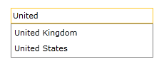
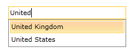
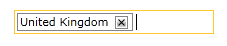
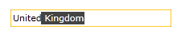
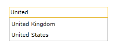
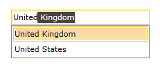

# AutoComplete

The main feature of __RadAutoCompleteBox__ control is its AutoComplete functionality. Its behavior can be customized by setting one of the built-in modes.

## Changing the AutoCompleteMode

RadAutoCompleteBox control has three built-in __AutoCompleteModes__ - __Suggest__, __Append__, __SuggestAppend__. By default the AutoCompleteMode property is set to __SuggestAppend__.

In the next examples we will demonstrate the difference between the AutoCompleteModes:

>Before proceeding with next examples please read the help article about [Binding To Object]().

### Suggest Mode

In __Suggest__ mode after one or more matches are found they are displayed in the DropDown portion of the control.

The XAML should look like this:

__Example 1: Declaring RadAutoCompleteBox with Suggest AutoCompleteMode__

```XAML
	<telerik:RadAutoCompleteBox x:Name="autoComleteBox"  Width="200"
	                            ItemsSource="{Binding Countries}"
	                            DisplayMemberPath="Name" 
	                            AutoCompleteMode="Suggest"/>
```

The next screenshots show how the control looks in __Suggest__ mode:








### Append Mode

In __Append__ mode after one or more matches are found the DropDown portion of the control is hidden and the value in the TextBox is appended with the first matched item.

The XAML should look like this:

__Example 2: Declaring RadAutoCompleteBox with Append AutoCompleteMode__

```XAML
	<telerik:RadAutoCompleteBox x:Name="autoComleteBox"  Width="200"
	                            ItemsSource="{Binding Countries}"
	                            DisplayMemberPath="Name" 
	                            AutoCompleteMode="Append"/>
```

The next screenshots show how the control looks in Append mode:





### Suggest and Append Mode

__SuggestAppend__ mode combines the behavior of the two previous modes.

>In this mode when input is typed in the textbox of the control the first item in the DropDown portion of the control is not highlighted and appended. The append functionality is triggered when you navigate with the keyboard to a specific item.

The XAML should look like this:

__Example 3: Declaring RadAutoCompleteBox with SuggestAppend AutoCompleteMode__

```XAML
	<telerik:RadAutoCompleteBox x:Name="autoComleteBox"  Width="200"
	                            ItemsSource="{Binding Countries}"
	                            DisplayMemberPath="Name"
	                            AutoCompleteMode="SuggestAppend"/>
```

The next screenshots show how the control looks in SuggestAppend mode:







## See Also

* [Filtering Behavior]()
* [Highlight Behavior]()