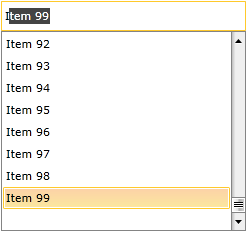
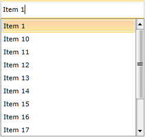

# Highlight Behavior

The `HighlightBehavior` of `RadAutoCompleteBox` allows you to choose which item of the filtered items by the control to be highlighted depending on a custom logic.

## Implementing Custom HighlightBehavior

The following example will demonstrate how to implement a custom __HighlightBehavior__ that will always highlight the last matching item unless the entered text completely matches an item from the ItemsSource of __RadAutoCompleteBox__. The ItemsSource should contain items of type Item with a Name property used as a __DisplayMemberPath__.

Firstly you would need to create a custom class that inherits from the default __HighlightBehavior__ of __RadAutoCompleteBox__:

#### __[C#] Creation of custom class__

{{region cs-radautocompletebox-features-highlightbehavior-0}}
	public class MyHighlightBehavior : HighlightBehavior
	{
	}
{{endregion}}

#### __[VB] Creation of custom class__

{{region vb-radautocompletebox-features-highlightbehavior-0}}
	Public Class MyHighlightBehavior
		Inherits HighlightBehavior
	End Class
{{endregion}}

Next thing you have to do is to override the __FindHighlightedIndex()__ method of the behavior and implement the needed custom logic. For this scenario you will need to return the index of the last item of the filtered items if there isn't exact match:

#### __[C#] Overriding FindHighlightedIndex__

{{region cs-radautocompletebox-features-highlightbehavior-1}}
	public override int FindHighlightedIndex(string searchText, System.Collections.IList filteredItems, IEnumerable<object> escapedItems, string textSearchPath, TextSearchMode textSearchMode)
	{
	    var items = filteredItems.OfType<Item>().ToList<Item>();
	    if (items != null)
	    {
	        if (items.Any(x => x.Name == searchText))
	        {
	            // there is an exact match
	            var matchedItem = items.First(x => x.Name == searchText);
	            // return the index of the matched item
	            return items.IndexOf(matchedItem);
	        }
	    }
	    // there isn't exact match
	    // return the index of the last item from the filtered items 
	    return items.Count - 1;
	}
{{endregion}}

#### __[VB] Overriding FindHighlightedIndex__

{{region vb-radautocompletebox-features-highlightbehavior-1}}
	Public Overrides Function FindHighlightedIndex(ByVal searchText As String, ByVal filteredItems As System.Collections.IList, ByVal escapedItems As IEnumerable(Of Object), ByVal textSearchPath As String, ByVal textSearchMode As TextSearchMode) As Integer
		Dim items = filteredItems.OfType(Of Item)().ToList()
		If items IsNot Nothing Then
			If items.Any(Function(x) x.Name = searchText) Then
				'there is an exact match
				Dim matchedItem = items.First(Function(x) x.Name = searchText)
				'return the index of the matched item
				Return items.IndexOf(matchedItem)
			End If
		End If
		'there isn't exact match
		'return the index of the last item from the filtered items 
		Return items.Count - 1
	End Function
{{endregion}}

>tipIf you don't want to highlight any of the filtered items you should return __-1__ in the __FindHighlightedIndex()__ method.

>If the returned index from the __FindHighlightedIndex()__ method goes out of range - no item will be highlighted (the index of the highlighted item will be set to -1).

After the behavior is implemented you have to set it as __HighlightBehavior__ of __RadAutoCompleteBox__ as shown below:

#### __[XAML] Setting the newly created behavior__

{{region xaml-radautocompletebox-features-highlightbehavior-0}}
	<telerik:RadAutoCompleteBox ItemsSource="{Binding Items}"
	                            DisplayMemberPath="Name"
	                            HighlightBehavior="{StaticResource MyHighlightBehavior}" />
{{endregion}}

The following figures demonstrate the final result:

Figure 1: When there isn't exact match the last filtered item is highlighted.

Figure 2: When there is exact match the matched item is highlighted.

## See Also

 * [AutoComplete]()

 * [Binding To Object]()

 * [Filtering Behavior]()
