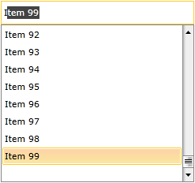
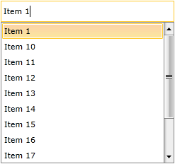

# Highlight Behavior

The `HighlightBehavior` of `RadAutoCompleteBox` allows you to choose which item of the filtered items by the control to be highlighted depending on a custom logic.

## Implementing Custom HighlightBehavior

The following example will demonstrate how to implement a custom __HighlightBehavior__ that will always highlight the last matching item unless the entered text completely matches an item from the ItemsSource of __RadAutoCompleteBox__. The ItemsSource should contain items of type Item with a Name property used as a __DisplayMemberPath__.

Firstly you would need to create a custom class that inherits from the default __HighlightBehavior__ of __RadAutoCompleteBox__:

__Creation of custom class__

<snippet id='radautocompletebox-features-highlightbehavior-creation_of_custom_class-cs' />

<snippet id='radautocompletebox-features-highlightbehavior-creation_of_custom_class-vb' />

__Creation of custom class__

Next thing you have to do is to override the __FindHighlightedIndex()__ method of the behavior and implement the needed custom logic. For this scenario you will need to return the index of the last item of the filtered items if there isn't exact match:

__Overriding FindHighlightedIndex__

<snippet id='radautocompletebox-features-highlightbehavior-overriding_findhighlightedindex-cs' />

<snippet id='radautocompletebox-features-highlightbehavior-overriding_findhighlightedindex-vb' />

__Overriding FindHighlightedIndex__

>tip If you don't want to highlight any of the filtered items you should return __-1__ in the __FindHighlightedIndex()__ method.

>If the returned index from the __FindHighlightedIndex()__ method goes out of range - no item will be highlighted (the index of the highlighted item will be set to -1).

After the behavior is implemented you have to set it as __HighlightBehavior__ of __RadAutoCompleteBox__ as shown below:

__Setting the newly created behavior__

<snippet id='radautocompletebox-features-highlightbehavior-setting_the_newly_created_behavior-xaml' />

The following figures demonstrate the final result:

Figure 1: When there isn't exact match the last filtered item is highlighted.

Figure 2: When there is exact match the matched item is highlighted.

## See Also

 * [AutoComplete]()

 * [Binding To Object]()

 * [Filtering Behavior]()
