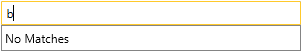
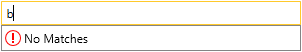
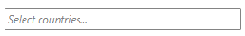

# Key Properties

The purpose of this help article is to show you the key properties of __RadAutoCompleteBox__ control. The topic includes the following properties:

* [Setting the ItemsSource](#setting-the-itemssource)

* [Changing the TextSearchMode](#changing-the-textsearchmode)

* [Changing the SelectionMode](#changing-the-selectionmode)

* [Setting the TextBoxStyle, BoxesItemTemplate, DropDownItemTemplate properties](#setting-the-style-and-template-properties)

* [Setting NoResultsContent, NoResultsContentTemplate properties](#setting-noresultscontent-noresultscontenttemplate-properties)

* [Setting WatermarkContent](#setting-watermarkcontent)

* [Other properties](#other-properties)

## Setting the ItemsSource

The ItemsSource property of __RadAutoCompleteBox__ could be set to any collection of items. However, it is recommended to set it to an ObservableCollection. Read [more]().

## Changing the TextSearchMode

The __TextSearchMode__ property represents the behavior by which items in the ItemsSource will be filtered. This property can be set to four values - __Contains__, __ContainsCaseSensitive__, __StartsWith__, __StartsWithCaseSensitive__. By default the TextSearchMode property is set to StartsWith.

## Changing the SelectionMode

The __SelectionMode__ property represents the behavior by which items will be selected in RadAutoCompleteBox control. This property can be set to two values - __Single__, __Multiple__. By default the SelectionMode property is set to Multiple. For more information, have a look at the [Selection]() article.

## Setting the Style and Template properties

It is possible to customize the way items in the DropDown portion of the control, the TextBox and the selected Items appear by customizing the __DropDownItemTemplate__, __TextBoxStyle__ and __BoxesItemTemplate__.

## Setting NoResultsContent, NoResultsContentTemplate properties

With the __NoResultsContent__ and __NoResultsContentTemplate__ properties of __RadAutoCompleteBox__ you could easily add a text or any other content to appear in the drop down whenever the control cannot find any matching items.

>__NoResultsContent__ and __NoResultsContentTemplate__ properties are available with Telerik UI for SilverlightWPF version R3 2016 or later.

The following snippet demonstrates how to set __NoResultsContent__ to simple text:

__Using NoResultsContent__

```XAML
	<telerik:RadAutoCompleteBox ItemsSource="{Binding Countries}" NoResultsContent="No Matches" /> 
```

And this would be the result:



For more complex representation you could use __NoResultsContentTemplate__ in order to apply a DataTemplate containing the desired layout. The following example shows how to display an icon in front of the text:

__Using NoResultsContentTemplate__

```XAML
	<telerik:RadAutoCompleteBox ItemsSource="{Binding Countries}" NoResultsContent="No Matches">
		<telerik:RadAutoCompleteBox.NoResultsContentTemplate>
			<DataTemplate>
				<StackPanel Orientation="Horizontal">
					<Grid  Width="16" Height="16" VerticalAlignment="Center" HorizontalAlignment="Left">
						<Ellipse Stroke="Red" StrokeThickness="1" />
						<Path Data="M0,8 L2,8 2,10 0,10 z M0,0 L2,0 2,7 0,7 z" Fill="Red" Stretch="Fill" Margin="7 3" />
					</Grid>
					<TextBlock Text="{Binding}" Margin="3 0" />
				</StackPanel>
			</DataTemplate>
		</telerik:RadAutoCompleteBox.NoResultsContentTemplate>
	</telerik:RadAutoCompleteBox> 
```

The result would be the following:



## Setting WatermarkContent

The **WatermarkContent** property specifies the text or any other content to be displayed when RadAutoCompleteBox's **TextBox** is not focused. When in **Single** SelectionMode no item should be selected for the watermark content to be visible.

#### __Figure 1: Custom Watermark Content__



## Other properties

There are some other key properties in RadAutoCompleteBox:

* __MaxDropDownHeight__: Gets or sets the maximum height of the dropdown portion of the AutoCompleteBox control.

* __TextSearchPath__: Gets or sets the property path that is used to get the autocomplete text to filter items.

* __SelectedItem__: Gets or sets the currently selected item into RadAutoCompleteBox.

* __SelectedItems__: Gets or sets a collection containing the currently selected items into RadAutoCompleteBox.

* __HighlightedIndex__: Gets or sets the currently highlighted index in the dropdown portion of the control.

## See Also

 * [Overview]()
 * [Getting Started]()
 * [Selection]()