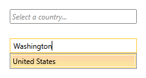
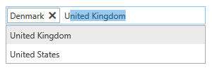

# Getting Started with {{ site.framework_name }} AutoCompleteBox

This tutorial will walk you through the creation of a sample application that contains __RadAutoCompleteBox__.

* [Adding Telerik Assemblies Using NuGet](#adding-telerik-assemblies-using-nuget)
* [Adding Assembly References Manually](#adding-assembly-references-manually)
* [Add RadAutoCompleteBox to the Project](#add-radautocompletebox-to-the-project)
* [Populate with Data](#populate-with-data)
* [Customize the Control](#customize-the-control)
* [Setting a Theme](#set-a-theme)

## Adding Telerik Assemblies Using NuGet

To use __RadAutoCompleteBox__ when working with NuGet packages, install the `Telerik.Windows.Controls.Input.for.Wpf.Xaml` package. The [package name may vary]() slightly based on the Telerik dlls set - [Xaml or NoXaml]()

Read more about NuGet installation in the [Installing UI for WPF from NuGet Package]() article.

>tip With the 2025 Q1 release, the Telerik UI for WPF has a new licensing mechanism. You can learn more about it [here]().

## Adding Assembly References Manually

If you are not using NuGet packages, you can add a reference to the following assemblies:

* __Telerik.Licensing.Runtime__
* __Telerik.Windows.Controls__
* __Telerik.Windows.Controls.Input__

## Add RadAutoCompleteBox to the Project

You can include the control in your projects by either dragging it from the toolbox in Visual Studio and Blend or by manually creating the control.

The following examples show how to create a __RadAutoCompleteBox__ control in the code-behind and in XAML:

__Example 1: Creating a RadAutoCompleteBox in code-behind__

```C#
	RadAutoCompleteBox autoCompleteBox = new RadAutoCompleteBox();
```

__Example 1: Creating a RadAutoCompleteBox in code-behind__

```VB
	Dim autoCompleteBox As New RadAutoCompleteBox()
```

__Example 1: Creating a RadAutoCompleteBox in XAML__

```XAML
	<UserControl xmlns:telerik="http://schemas.telerik.com/2008/xaml/presentation">
	    <Grid x:Name="LayoutRoot" Background="White">
	        <telerik:RadAutoCompleteBox x:Name="radAutoCompleteBox"/>
	    </Grid>
	</UserControl>
```

## Populate with Data

In order to populate the RadAutoCompleteBox with data, you can set its **ItemsSource** property to any **IEnumerable** collection of items.

__Example 2: Set RadAutoCompleteBox's ItemsSource__

```C#
    public MainWindow()
    {
        InitializeComponent();
        var countries = new ObservableCollection<Country>()
        {
            new Country() { Name = "Australia", Capital = "Canberra" },
            new Country() { Name = "Bulgaria", Capital = "Sofia" },
            new Country() { Name = "Canada", Capital = "Ottawa" },
            new Country() { Name = "Denmark", Capital = "Copenhagen" },
            new Country() { Name = "France", Capital = "Paris" },
            new Country() { Name = "Germany", Capital = "Berlin" },
            new Country() { Name = "India", Capital = "New Delhi" },
            new Country() { Name = "Italy", Capital = "Rome" },
            new Country() { Name = "Norway", Capital = "Oslo" },
            new Country() { Name = "Russia", Capital = "Moscow" },
            new Country() { Name = "Spain ", Capital = "Madrid" },
            new Country() { Name = "United Kingdom", Capital = "London" },
            new Country() { Name = "United States", Capital = "Washington, D.C." },
        };

        this.AutoComplete.ItemsSource = countries;
    }
```

## Customize the Control

To actually display results when using the ObservableCollection from **Example 2** you have to specify the **DisplayMemberPath** which specifies the name or path of the property that is displayed for each data item.

You can then set the control's [abundance of properties]() to customize it per your needs.

__Example 3: Customize the RadAutoCompleteBox__

```C#
    <telerik:RadAutoCompleteBox x:Name="autoComplete" 
                                    AutoCompleteMode="Suggest" 
                                    DisplayMemberPath="Name"
                                    TextSearchPath="Capital"
                                    TextSearchMode="Contains"
                                    WatermarkContent="Select a country..." />
```

**Figure 1** illustrates the result from the code in **Example 3**.

#### __Figure 1: Customized RadAutoCompleteBox__


## Set a Theme

The controls from our suite support different themes. You can see how to apply a theme different than the default one in the [Setting a Theme]() help article.

>important Changing the theme using implicit styles will affect all controls that have styles defined in the merged resource dictionaries. This is applicable only for the controls in the scope in which the resources are merged. 

To change the theme, you can follow the steps below:
* Choose between the themes and add reference to the corresponding theme assembly (ex: **Telerik.Windows.Themes.Office2016.dll**). You can see the different themes applied in the **Theming** examples from our [WPF Controls Examples](https://demos.telerik.com/wpf/)[Silverlight Controls Examples](https://demos.telerik.com/silverlight/#AutoCompleteBox/Theming) application.

* Merge the ResourceDictionaries with the namespace required for the controls that you are using from the theme assembly. For the __RadAutoCompleteBox__, you will need to merge the following resources:

	* __Telerik.Windows.Controls__
	* __Telerik.Windows.Controls.Input__

__Example 4__ demonstrates how to merge the ResourceDictionaries so that they are applied globally for the entire application.

__Example 4: Merge the ResourceDictionaries__  
```XAML
	<Application.Resources>
		<ResourceDictionary>
			<ResourceDictionary.MergedDictionaries>
				<ResourceDictionary Source="/Telerik.Windows.Themes.Office2016;component/Themes/System.Windows.xaml"/>
				<ResourceDictionary Source="/Telerik.Windows.Themes.Office2016;component/Themes/Telerik.Windows.Controls.xaml"/>
				<ResourceDictionary Source="/Telerik.Windows.Themes.Office2016;component/Themes/Telerik.Windows.Controls.Input.xaml"/>
			</ResourceDictionary.MergedDictionaries>
		</ResourceDictionary>
	</Application.Resources>
```

>Alternatively, you can use the theme of the control via the [StyleManager](https://docs.telerik.com/devtools/wpf/styling-and-appearance/stylemanager/common-styling-apperance-setting-theme-wpf)[StyleManager](https://docs.telerik.com/devtools/silverlight/styling-and-appearance/stylemanager/common-styling-apperance-setting-theme).

__Figure 2__ shows a __RadAutoCompleteBox__ with the **Office2016** theme applied.
	
#### __Figure 2: RadAutoCompleteBox with the Office2016 theme__



## Telerik UI for WPF Learning Resources

* [Telerik UI for WPF AutoCompleteBox Component](https://www.telerik.com/products/wpf/autocompletebox.aspx)
* [Getting Started with Telerik UI for WPF Components]()
* [Telerik UI for WPF Installation]()
* [Telerik UI for WPF and WinForms Integration]()
* [Telerik UI for WPF Visual Studio Templates]()
* [Setting a Theme with Telerik UI for WPF]()
* [Telerik UI for WPF Virtual Classroom (Training Courses for Registered Users)](https://learn.telerik.com/learn/course/external/view/elearning/16/telerik-ui-for-wpf) 
* [Telerik UI for WPF License Agreement](https://www.telerik.com/purchase/license-agreement/wpf-dlw-s)


## See Also

 * [Overview]()
 * [Key Properties]()
 * [AutoComplete]()
 * [Events]()
