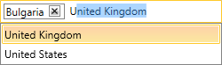

# Overview









Thank you for choosing Progress® Telerik® __RadAutoCompleteBox__!

__RadAutoCompleteBox__ is a SilverlightWPF control that provides a textbox for the user's input and suggests possible matches based on that input. The control has a number of advanced features such as support for different autocomplete modes, keyboard navigation, virtualization for working with thousands of items in its ItemsSource, as well as full customization capabilities.

Here are some of the control's key features:

* __Different autocomplete modes__: The SilverlightWPF RadAutoCompleteBox supports different autocomplete modes - Suggest, Append, SuggestAppend. [Read more]()

* __Async filtering__: Using the [AsyncFilteringBehavior]() makes the filtering of huge amount of items unnoticeable.

* __Expression Blend support__: All controls from the UI for SilverlightWPF suite can be easily customized using Expression Blend.

* __Keyboard support__: The SilverlightWPF RadAutoCompleteBox supports several [keyboard shortcuts]() for performing the most common tasks.

## See Also

* [AutoComplete]()
* [Filtering Behavior]()
* [Keyboard Support]()
* [Key Properties]()
