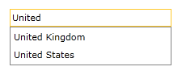
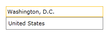

# Binding To Object

To bind __RadAutoCompleteBox__ to a collection of business object, you should use its ItemsSource property.

The following example will guide you through the process of binding your RadAutoCompleteBox to a collection of business objects. The example includes:

* [Binding the ItemsSource](#binding-the-itemssource)

* [Using DisplayMemberPath and TextSearchPath](#using-displaymemberpath-and-textsearchpath)

>tipBefore proceeding with this tutorial you should get familiar with the [Data Binding]() support of the RadAutoCompleteBox control.

## Binding the ItemsSource

1. First you will need to add __RadAutoCompleteBox__ to your project:

	__Add RadAutoCompleteBox__

	```XAML
		<telerik:RadAutoCompleteBox />
	```

1. Create a business object called Country:

	__Creation of the object__

	```C#
		public class Country
		{
		    public string Name { get; set; }
		    public string Capital { get; set; }
		}
	```

1. Create a new class named __ViewModel__. In fact, this will be the data source for the RadAutoCompleteBox and this class has only one purpose - to initialize a collection with sample data.

	__ViewModel creation__

	```C#
		public class ViewModel
		{
		    public ObservableCollection<Country> Countries { get; set; }
		    public ViewModel()
		    {
		        this.Countries = new ObservableCollection<Country>()
		        {
		            new Country() { Name = "Australia", Capital = "Canberra" },
		            new Country() { Name = "Bulgaria", Capital = "Sofia" },
		            new Country() { Name = "Canada", Capital = "Ottawa" },
		            new Country() { Name = "Denmark", Capital = "Copenhagen" },
		            new Country() { Name = "France", Capital = "Paris" },
		            new Country() { Name = "Germany", Capital = "Berlin" },
		            new Country() { Name = "India", Capital = "New Delhi" },
		            new Country() { Name = "Italy", Capital = "Rome" },
		            new Country() { Name = "Norway", Capital = "Oslo" },
		            new Country() { Name = "Russia", Capital = "Moscow" },
		            new Country() { Name = "Spain ", Capital = "Madrid" },
		            new Country() { Name = "United Kingdom", Capital = "London" },
		            new Country() { Name = "United States", Capital = "Washington, D.C." },
		        };
		    }
		}
	```

1. Declare the __ViewModel__ as a resource in your XAML: 

	__Declaring the ViewModel__

	```XAML
		<UserControl.Resources>
		    <local:ViewModel x:Key="ViewModel"/>
		</UserControl.Resources>
	```

1. Update your __RadAutoCompleteBox__ declaration and its __ItemsSource__ property:

	__Update the ItemsSource property__

	```XAML
		<telerik:RadAutoCompleteBox ItemsSource="{Binding Countries, Source={StaticResource ViewModel}}"/>
	```

1. Set the DisplayMemberPath property of the control.

	__Setting the DisplayMemberPath__

	```XAML
		<telerik:RadAutoCompleteBox ItemsSource="{Binding Countries, Source={StaticResource ViewModel}}"
		                            DisplayMemberPath="Name"/>
	```

The next screenshots show the final result:





## Using DisplayMemberPath and TextSearchPath

Setting both __DisplayMemberPath__ and __TextSearchPath__ properties will allow to search by specific property of the business object and at the same time display a different property in the DropDown and in the TextBox after selection.

In the next code snippets we will demonstrate how to use these properties together by extending the previous example from the [Binding the ItemsSource](#binding-the-itemssource) section:

1. Set the __DisplayMemberPath__ to a specific property of the used business object:

	__Setting the DisplayMemberPath__

	```XAML
		<telerik:RadAutoCompleteBox ItemsSource="{Binding Countries, Source={StaticResource ViewModel}}"
		                            DisplayMemberPath="Name"/>
	```

1. Set the __TextSearchPath__ to a specific property of the used business object: 

	__Setting the TextSearchPath__

	```XAML
		<telerik:RadAutoCompleteBox ItemsSource="{Binding Countries, Source={StaticResource ViewModel}}"
		                            DisplayMemberPath="Name"
		                            TextSearchPath="Capital"/>
	```

The next screenshots show how __RadAutoCompleteBox__ behaves when its DisplayMemberPath and TextSearchPath properties are set:





