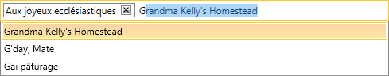
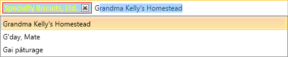

# BoxesItemStyle

The __BoxesItemStyle__ property, introduced with the Q1 2016 release of UI for WPFSilverlight, makes it easy to customize the boxes of the selected items of a  __RadAutoCompleteBox__. The following article will demonstrate how to apply a custom __BoxesItemStyle__ to a __RadAutoCompleteBox__.

## Applying BoxesItemStyle

First, you need to create a __RadAutoCompleteBox__ with an ItemsSource bound to a collection of business objects:

>Check [this](https://docs.telerik.com/devtools/wpf/controls/radautocompletebox/populating-with-data/binding-to-object.html)[this](https://docs.telerik.com/devtools/silverlight/controls/radautocompletebox/populating-with-data/binding-to-object.html) article for some more detailed information how to bind the __ItemsSource__ to a collection of business objects.

__RadAutoCompleteBox declaration__

```XAML
	<telerik:RadAutoCompleteBox x:Name="radautocomplete1" Margin="10" ItemsSource="{Binding Agency}" DisplayMemberPath="Name"/>
```

The following screenshot shows how __RadAutoCompleteBox__ will look:



Next, you need to create a custom Style that targets __RadAutoCompleteBoxItem__ and customize the items as needed:

__Custom BoxesItemStyle__

```XAML
	<Style TargetType="telerik:RadAutoCompleteBoxItem" x:Key="CustomBoxesItemxStyle">
	  <Setter Property="Foreground" Value="Yellow" />
	  <Setter Property="Background" Value="LightBlue" />
	  <Setter Property="FontFamily" Value="Calibri" />
	  <Setter Property="FontSize" Value="14" />
	  <Setter Property="BorderThickness" Value="1" />
	  <Setter Property="BorderBrush" Value="Red" />
	</Style>
```

>If you are using [Implicit Styles](https://docs.telerik.com/devtools/wpf/styling-and-appearance/styling-apperance-implicit-styles-overview)[Implicit Styles](https://docs.telerik.com/devtools/silverlight/styling-and-appearance/styling-apperance-implicit-styles-overview), please notice that the Style should based on the default __RadAutoCompleteBoxItemStyle__.

__Custom BoxesItemStyle with Implicit Styles__

```XAML
	<Style TargetType="telerik:RadAutoCompleteBoxItem" x:Key="CustomBoxesItemxStyle1" BasedOn="{StaticResource RadAutoCompleteBoxItemStyle}">
	  <Setter Property="Foreground" Value="Yellow" />
	  <Setter Property="Background" Value="LightBlue" />
	  <Setter Property="FontFamily" Value="Calibri" />
	  <Setter Property="FontSize" Value="14" />
	  <Setter Property="BorderThickness" Value="1" />
	  <Setter Property="BorderBrush" Value="Red" />
	</Style>
```

Finally, you need to set the __BoxesItemStyle__ property of the __RadAutoCompleteBox__ with the created Style:

__Setting of BoxesItemStyle__

```XAML
	<telerik:RadAutoCompleteBox x:Name="radautocomplete" Margin="10"
	                                ItemsSource="{Binding Agency}"
	                                BoxesItemStyle="{StaticResource CustomBoxesItemxStyle}"
	                                DisplayMemberPath="Name"/>
```

The following screenshot shows how the __RadAutoCompleteBox__ looks after the __BoxesItemStyle__ gets applied:



## See Also

 * [Overview]()
 
 * [BoxesItemTemplate]()
