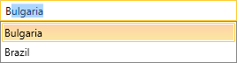
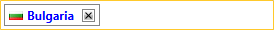

# Customizing the BoxesItemTemplate

In __RadAutoCompleteBox__ you can customize the way the items are displayed in the input area of the control.

By customizing the __BoxesItemTemplate__ you could easily apply a different appearance for the selected items of __RadAutoCompleteBox__ when the __SelectionMode__ is set to __Multiple__.

## Creating custom BoxesItemTemplate

The following example will demonstrate how you could easily create __BoxesItemTemplate__ in order to show an Image inside the box of the selected item and change the foreground color of the item's text.

>important The __BoxesItemTemplate__ is applied only when the __SelectionMode__ property is set to __Multiple__.

Firstly you need to create a new business object named for example Country. Its structure is shown in the code-snippet below:

__Creation of the business object__

```C#
    public class Country
    {
        public string Name { get; set; }
        public string Capital { get; set; }
        public Continent Continent { get; set; }
        public string Flag { get; set; }
    }
```

The __Flag__ property should be of type string and will be bound to the __Source__ property of the Image. As for the __Continent__ property it is an enumeration that contains all continents.

After that you need to create the ViewModel and populate it with some data.

>tipMore detailed information how to bind __RadAutoCompleteBox__ to an object could be found [here]().

Next a valid DataTemplate with the correct bindings for the __Name__ and __Flag__ property of the ItemsSource items should be created: 

__Declaring the BoxesItemTemplate__

```XAML
	<DataTemplate x:Key="CustomBoxesItemTemplate">
	  <StackPanel Orientation="Horizontal">
	    <Image Width="14"
	         Height="12"
	         Margin="2"
	         Source="{Binding Flag}" />
	    <TextBlock Foreground="{Binding Converter={StaticResource ContinentToColorConverter}}"
	           Margin="2"
	           FontWeight="Bold"
	           Text="{Binding Name}" />
	  </StackPanel>
	</DataTemplate>
```

The __ContinentToColorConverter__ converts the __Continent__ property of the item into a Color that is set to the Foreground property of the TextBlock that visualizes the Name property - each country has different color based on its continent.

Finally you will need to declare __RadAutoCompleteBox__ in the xaml and set its __ItemsSource__, __DisplayMemberPath__ and __BoxesItemTemplate__ properties:

__Setting the BoxesItemTemplate__

```XAML
	<telerik:RadAutoCompleteBox ItemsSource="{Binding Countries}"
	                            DisplayMemberPath="Name"
	                            BoxesItemTemplate="{StaticResource CustomBoxesItemTemplate}"/>
```

The following screenshots show the final result:





>tip Find a runnable project of the previous example in the [WPF Samples GitHub repository](https://github.com/telerik/xaml-sdk/tree/master/AutoCompleteBox/CustomBoxesItemTemplate).

## See Also

 * [Binding To Object]()
