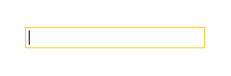
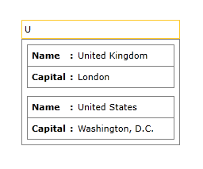
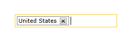
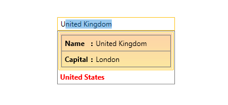

# Customizing the DropDownItemTemplate and DropDownItemTemplateSelector

In the __RadAutoCompleteBox__ control you can customize the way items are rendered in the DropDown portion of the control. You can do that by setting the __DropDownItemTemplate__ or __DropDownItemTemplateSelector__ properties. They allow you to show different templates for the DropDown items.

## Creating custom DropDownItemTemplate

The next example will demonstrate how to create a custom DropDownItemTemplate in order to show two of the properties of the bound items from the ItemsSource collection.

>Before proceeding with this example you should get familiar with [Binding To Object]().

The next steps show how to create and set a custom DropDownItemTemplate to the RadAutoCompleteBox control:

1. First we will need to create and populate the __ViewModel__ with some sample data, more details can be found [here]().

1. Next we need to create a valid __DataTemplate__ and set the necessary binding for the __Name__, __Capital__ properties of the ItemsSource items:

__Example 1: Declaring valid DataTemplate__
<snippet id='radautocompletebox-styles-and-templates-customizing-drop-down-itemtemplate-example_1_declaring_valid_datatemplate-xaml' />

1. Finally you will need to declare the __RadAutoCompleteBox__ in the xaml and set its __ItemsSource__, __DisplayMemberPath__ and __DropDownItemTemplate__ properties:

__Example 2: Setting the DropDownItemTemplate__
<snippet id='radautocompletebox-styles-and-templates-customizing-drop-down-itemtemplate-example_2_setting_the_dropdownitemtemplate-xaml' />

The next screenshots show the final result:
#### __Figure 1__

#### __Figure 2__

#### __Figure 3__

## Creating custom DropDownItemTemplateSelector

This section will describe how you can create a custom __DropDownItemTemplateSelector__ in order to display different template depending on a property. We are going to extend the __Example 1__. First, we need to create a class which derives from __DataTemplateSelector__ and overrides the SelectTemplate method. Inside the method, we can return different template depending on our condition.

__Example 3: Custom DataTemplateSelector class__
<snippet id='radautocompletebox-styles-and-templates-customizing-drop-down-itemtemplate-example_3_custom_datatemplateselector_class-xaml' />

The next step is to specify the MyDropDownItemTemplateSelector in the Resources of the Window and set our custom templates. Then we can set our custom DataTemplateSelector to the __DropDownItemTemplateSelector__ property.

__Example 4: Setting the DropDownItemTemplateSelector__
<snippet id='radautocompletebox-styles-and-templates-customizing-drop-down-itemtemplate-example_4_setting_the_dropdownitemtemplateselector-xaml' />

## See Also

 * [Binding To Object]()
