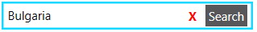
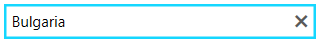

# Customize the Buttons

RadAutoSuggestBox has two customizeable buttons - the clear button and the query button.

You can customize those by setting the __ClearButtonContent__ and __QueryButtonContent__ properties.

## Changing Button Icons

The default content template of the buttons contains a [RadGlyph]() control, so you can use a [glyph code]() to easily change the default icons.

>tip See the default buttons appearance in the [Visual Structure]() article.

__Example 1: Changing the default glyphs__
```XAML
	  <telerik:RadAutoSuggestBox QueryButtonContent="&#xe019;" ClearButtonContent="&#xe10c;" />
```

#### Figure 1: Query and clear buttons with changed glyph icons


## Customizing the Buttons UI

To replace the default RadGlyph element used to display the buttons' content, set the __QueryButtonContentTemplate__ and __ClearButtonContentTemplate__ properties of RadAutoSuggestBox.

__Example 2: Changing the default content template__
```XAML
	<telerik:RadAutoSuggestBox QueryButtonContent="Search" ClearButtonContent="X">
		<telerik:RadAutoSuggestBox.QueryButtonContentTemplate>
			<DataTemplate>
				<TextBlock Text="{Binding}" Foreground="White" Background="#2D2D30" Padding="3" Opacity="0.8"/>
			</DataTemplate>
		</telerik:RadAutoSuggestBox.QueryButtonContentTemplate>
		<telerik:RadAutoSuggestBox.ClearButtonContentTemplate>
			<DataTemplate>
				<TextBlock Text="{Binding}" Foreground="Red" FontWeight="Bold"/>
			</DataTemplate>
		</telerik:RadAutoSuggestBox.ClearButtonContentTemplate>
	</telerik:RadAutoSuggestBox>
```

#### Figure 2: Query and clear buttons with changed content template


## Hiding the Buttons

To control the visibility of the query and clear buttons, set the __QueryButtonVisibility__ and __ClearButtonVisibility__ properties of RadAutoSuggestBox.

__Example 3: Hiding the query button__
```XAML
	<telerik:RadAutoSuggestBox QueryButtonVisibility="Collapsed" />
```

#### Figure 3: Hidden query button


When the __ClearButtonVisibility__ property is set to __Auto__, the button shows only when the control is focused and the TextBox is not empty. This is the default behavior.

## Commands

To customize also the actions executed on query and clear button clicks, set the __QueryButtonCommand__ and __ClearButtonCommand__ properties of RadAutoSuggestBox. Read more in the [Commands]() article.

## See Also  
 * [Getting Started]()
 * [Events]()   
 * [Xaml vs. NoXaml]()
