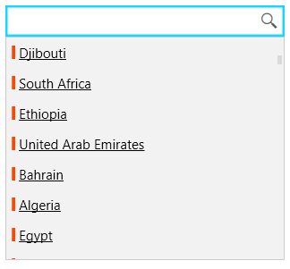
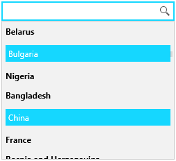
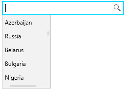

# Customize the Drop Down Items

This article shows how to customize the drop down items appearance and the drop down size.

## ItemTemplate and ItemTemplateSelector

The UI of the items shown in the drop down list can be customized via the __ItemTemplate__ and __ItemTemplateSelector__ properties of RadAutoSuggestBox.

The __ItemTemplate__ allows you to define a DataTemplate with any UIElements, which will be applied for each item from the ItemsSource of RadAutoSuggestBox.

__Example 1: Setting ItemTemplate__
```XAML
	<telerik:RadAutoSuggestBox x:Name="radAutoSuggestBox"
							   TextMemberPath="Name">
		<telerik:RadAutoSuggestBox.ItemTemplate>
			<DataTemplate>
				<StackPanel Orientation="Horizontal">
					<Rectangle Fill="OrangeRed" Width="3" Height="12"/>
					<TextBlock Text="{Binding Name}" Margin="3 0 0 0" TextDecorations="Underline" />
				</StackPanel>
			</DataTemplate>
		</telerik:RadAutoSuggestBox.ItemTemplate>
	</telerik:RadAutoSuggestBox>
```

#### Figure 1: Custom ItemTemplate


The __ItemTemplateSelector__ allows you to choose a different DataTemplate for each item in the ItemsSource, based on a condition. 

__Example 2: Implementing the template selector__
```C#
	public class AutoSuggestBoxItemTemplateSelector : DataTemplateSelector
    {
        public DataTemplate DefaultTemplate { get; set; }
        public DataTemplate AlternateTemplate { get; set; }
		
        public override DataTemplate SelectTemplate(object item, DependencyObject container)
        {
            var dataItem = (CountryInfo)item;
            if (dataItem.Name.Equals("Bulgaria"))
            {
                return this.AlternateTemplate;
            }
            return this.DefaultTemplate;
        }
    }
```

__Example 3: Setting ItemTemplateSelector__
```XAML
	<telerik:RadAutoSuggestBox x:Name="radAutoSuggestBox" TextMemberPath="Name">
		<telerik:RadAutoSuggestBox.ItemTemplateSelector>
			<local:AutoSuggestBoxItemTemplateSelector>
				<local:AutoSuggestBoxItemTemplateSelector.DefaultTemplate>
					<DataTemplate>                            
						<TextBlock Text="{Binding Name}" FontWeight="Bold" />
					</DataTemplate>
				</local:AutoSuggestBoxItemTemplateSelector.DefaultTemplate>
				<local:AutoSuggestBoxItemTemplateSelector.AlternateTemplate>
					<DataTemplate>
						<Border Background="#15D7FF" Padding="4">
							<TextBlock Text="{Binding Name}" Foreground="White" />
						</Border>
					</DataTemplate>
				</local:AutoSuggestBoxItemTemplateSelector.AlternateTemplate>
			</local:AutoSuggestBoxItemTemplateSelector>		   
		</telerik:RadAutoSuggestBox.ItemTemplateSelector>
	</telerik:RadAutoSuggestBox>
```

#### Figure 2: Custom ItemTemplateSelector


The following example shows how to setup a basic RadAutoSuggestBox in order to test the ItemTemplate features.

__Example 4: Creating data model for the items__
```C#
	public static class CountryDataProvider
    {
        public static List<CountryInfo> Countries { get; set; }

        static CountryDataProvider()
        {
            Countries = new List<CountryInfo>();
            var cultures = CultureInfo.GetCultures(CultureTypes.SpecificCultures);
            foreach (CultureInfo culture in cultures)
            {
                var regionInfo = new RegionInfo(culture.LCID);
                if (!Countries.Any(x => x.Name.Equals(regionInfo.EnglishName)))
                {
                    Countries.Add(new CountryInfo() { Name = regionInfo.EnglishName });
                }
            }
        }
    }

    public class CountryInfo
    {
        public string Name { get; set; }
    }
```

__Example 5: Populating the control with data__
```C#
	public MainWindow()
	{
		InitializeComponent();
		this.radAutoSuggestBox.ItemsSource = CountryDataProvider.Countries;
	}
```

## Drop Down Settings

The RadAutoSuggestBox control provides few properties to change the drop down default sizes - __MaxDropDownHeight__, __MaxDropDownWidth__ and __MinDropDownWidth__.

__Example 6: Setting drop down sizes__
```XAML
	<telerik:RadAutoSuggestBox MaxDropDownHeight="150" MaxDropDownWidth="100"
```

#### Figure 3: Custom drop down sizes


Additionally, you can manually open or close the drop down via the __IsDropDownOpen__ property of RadAutoSuggestBox.

## See Also  
 * [Getting Started]() 
 * [Visual Structure]()
 * [Events]()
