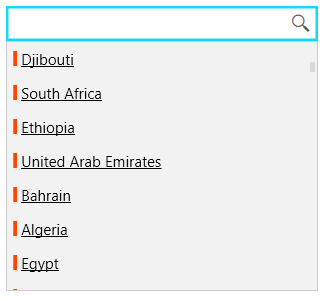
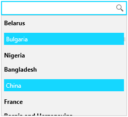
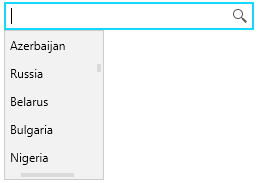

# Customize the Drop Down Items

This article shows how to customize the drop down items appearance and the drop down size.

## ItemTemplate and ItemTemplateSelector

The UI of the items shown in the drop down list can be customized via the __ItemTemplate__ and __ItemTemplateSelector__ properties of RadAutoSuggestBox.

The __ItemTemplate__ allows you to define a DataTemplate with any UIElements, which will be applied for each item from the ItemsSource of RadAutoSuggestBox.

__Example 1: Setting ItemTemplate__
<snippet id='radautosuggestbox-appearance-customize-drop-down-items-example_1_setting_itemtemplate-xaml' />

#### Figure 1: Custom ItemTemplate

The __ItemTemplateSelector__ allows you to choose a different DataTemplate for each item in the ItemsSource, based on a condition. 

__Example 2: Implementing the template selector__
<snippet id='radautosuggestbox-appearance-customize-drop-down-items-example_2_implementing_the_template_selector-cs' />

__Example 3: Setting ItemTemplateSelector__
<snippet id='radautosuggestbox-appearance-customize-drop-down-items-example_3_setting_itemtemplateselector-xaml' />

#### Figure 2: Custom ItemTemplateSelector

The following example shows how to setup a basic RadAutoSuggestBox in order to test the ItemTemplate features.

__Example 4: Creating data model for the items__
<snippet id='radautosuggestbox-appearance-customize-drop-down-items-example_4_creating_data_model_for_the_items-cs' />

__Example 5: Populating the control with data__
<snippet id='radautosuggestbox-appearance-customize-drop-down-items-example_5_populating_the_control_with_data-cs' />

## Drop Down Settings

The RadAutoSuggestBox control provides few properties to change the drop down default sizes - __MaxDropDownHeight__, __MaxDropDownWidth__ and __MinDropDownWidth__.

__Example 6: Setting drop down sizes__
<snippet id='radautosuggestbox-appearance-customize-drop-down-items-example_6_setting_drop_down_sizes-xaml' />

#### Figure 3: Custom drop down sizes

Additionally, you can manually open or close the drop down via the __IsDropDownOpen__ property of RadAutoSuggestBox.

## See Also  
 * [Getting Started]() 
 * [Visual Structure]()
 * [Events]()
