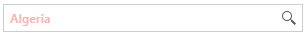

# Customize the TextBox

The appearance of the TextBox part of RadAutoSuggestBox can be customized via the __TextBoxStyle__ property of the control.

The TextBoxStyle property expects a Style object with a __TargetType__ set to __RadWatermarkTextBox__.

__Example 1: Setting TextBoxStyle__
```XAML
	<telerik:RadAutoSuggestBox Foreground="Red">	
		<telerik:RadAutoSuggestBox.TextBoxStyle>
			<!-- The BasedOn property is required when using NoXaml dlls. Otherwise, remove the setting. -->
			<Style TargetType="telerik:RadWatermarkTextBox" BasedOn="{StaticResource RadWatermarkTextBoxStyle}">				
				<Setter Property="Opacity" Value="0.5" />
				<Setter Property="FontWeight" Value="Bold" />                    
			</Style>
		</telerik:RadAutoSuggestBox.TextBoxStyle>
	</telerik:RadAutoSuggestBox>
```



## See Also  
 * [Getting Started]()
 * [Events]()
 * [Buttons]()
 * [Xaml vs. NoXaml]()
 * [Editing Control Templates]()
