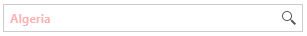

# Customize the TextBox

The appearance of the TextBox part of RadAutoSuggestBox can be customized via the __TextBoxStyle__ property of the control.

The TextBoxStyle property expects a Style object with a __TargetType__ set to __RadWatermarkTextBox__.

__Example 1: Setting TextBoxStyle__
<snippet id='radautosuggestbox-appearance-customize-textbox-example_1_setting_textboxstyle-xaml' />

## See Also  
 * [Getting Started]()
 * [Events]()
 * [Buttons]()
 * [Xaml vs. NoXaml]()
 * [Editing Control Templates]()
