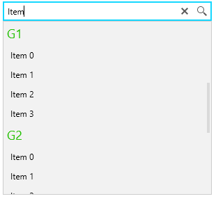

# Grouping

RadAutoSuggestBox allows you to visualize groups when ICollectionView with GroupDescriptors is used as an ItemsSource.

The following example shows how to populate the ItemsSource of RadAutoSuggestBox with an ICollectionView and enabling the grouping feature of the control. The feature shows group headers and organizes the items in the drop down of the control by groups. To enable the headers, set the __GroupStyle__ property of RadAutoSuggestBox.

> Read more about the GroupStyle object expected by the __GroupStyle__ property in [MSDN](https://docs.microsoft.com/en-us/dotnet/api/system.windows.controls.groupstyle?view=netframework-4.5).

__Example 1: Define RadAutoSuggestBox and enable grouping__
```XAML
	<telerik:RadAutoSuggestBox x:Name="radAutoSuggestBox" 
							   DisplayMemberPath="Name" 
							   TextMemberPath="Name"
							   TextChanged="RadAutoSuggestBox_TextChanged">
		<telerik:RadAutoSuggestBox.GroupStyle>
			<GroupStyle>
				<GroupStyle.HeaderTemplate>
					<DataTemplate>
						<TextBlock Text="{Binding Name}" 
								   FontSize="18"
								   Foreground="#27C106" 
								   Margin="5" />
					</DataTemplate>
				</GroupStyle.HeaderTemplate>
			</GroupStyle>
		</telerik:RadAutoSuggestBox.GroupStyle>
	</telerik:RadAutoSuggestBox>
```

The GroupStyle setting is required in order to visualize the group headers.

__Example 2: Create model for the items__
```C#
	public class SuggestionInfo
    {
        public string Name { get; set; }
        public string GroupKey { get; set; }
    }
```

__Example 3: Populate the ItemsSource with ICollectionView object and prepare a filter__
```C#
	public MainWindow()
	{
		InitializeComponent();

		var source = new ObservableCollection<SuggestionInfo>();
		for (int i = 0; i < 3; i++)
		{
			string currentGroup = "G" + i;
			for (int k = 0; k < 4; k++)
			{
				source.Add(new SuggestionInfo() { Name = "Item " + k, GroupKey = currentGroup });
			}
		}

		var collectionView = CollectionViewSource.GetDefaultView(source);
		collectionView.GroupDescriptions.Add(new PropertyGroupDescription("GroupKey"));
		collectionView.Filter = new Predicate<object>(FilterItem);
		this.radAutoSuggestBox.ItemsSource = collectionView;
	}

	public bool FilterItem(object value)
	{
		return ((SuggestionInfo)value).Name.ToLowerInvariant().Contains(this.radAutoSuggestBox.Text.ToLowerInvariant());
	}
```

__Example 4: Trigger the ICollectionView filtering on TextChanged__
```C#
	private void RadAutoSuggestBox_TextChanged(object sender, Telerik.Windows.Controls.AutoSuggestBox.TextChangedEventArgs e)
	{
		if (e.Reason == TextChangeReason.UserInput)
		{
			var collectionView = (ICollectionView)this.radAutoSuggestBox.ItemsSource;
			collectionView.Refresh();
		}
	}
```



## See Also  
 * [Getting Started]() 
 * [Visual Structure]()
 * [Watermark]()