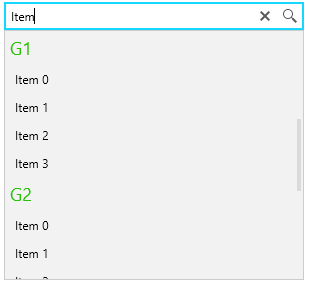

# Grouping

RadAutoSuggestBox allows you to visualize groups when ICollectionView with GroupDescriptors is used as an ItemsSource.

The following example shows how to populate the ItemsSource of RadAutoSuggestBox with an ICollectionView and enabling the grouping feature of the control. The feature shows group headers and organizes the items in the drop down of the control by groups. To enable the headers, set the __GroupStyle__ property of RadAutoSuggestBox.

> Read more about the GroupStyle object expected by the __GroupStyle__ property in [MSDN](https://docs.microsoft.com/en-us/dotnet/api/system.windows.controls.groupstyle?view=netframework-4.5).

__Example 1: Define RadAutoSuggestBox and enable grouping__
<snippet id='radautosuggestbox-features-grouping-example_1_define_radautosuggestbox_and_enable_grouping-xaml' />

The GroupStyle setting is required in order to visualize the group headers.

__Example 2: Create model for the items__
<snippet id='radautosuggestbox-features-grouping-example_2_create_model_for_the_items-cs' />

__Example 3: Populate the ItemsSource with ICollectionView object and prepare a filter__
<snippet id='radautosuggestbox-features-grouping-example_3_populate_the_itemssource_with_icollectionview_object_and_prepare_a_filter-cs' />

__Example 4: Trigger the ICollectionView filtering on TextChanged__
<snippet id='radautosuggestbox-features-grouping-example_4_trigger_the_icollectionview_filtering_on_textchanged-cs' />

## See Also  
 * [Getting Started]() 
 * [Visual Structure]()
 * [Watermark]()