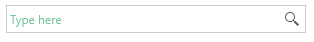

# Watermark

The watermark of RadAutoSuggestBox is the content shown in the TextBox when no text is entered.

The default watermark is empty. To change this, set the __WatermarkContent__ property of RadAutoSuggestBox.

__Example 1: Set watermark content__
```XAML
	<telerik:RadAutoSuggestBox WatermarkContent="Type here" />
```

#### Figure 1: Watermark content


## Customize the Watermark Behavior

The default behavior of the watermark is to get displayed only when no text is entered and the RadAutoSuggestBox control is not focused. To change this, set the __WatermarkBehavior__ property of RadAutoSuggestBox. The property expects one of the following values:

* __HiddenWhenFocused__ (default): The watermark is hidden when the control is focused. It displays when the control loses the focus.

* __HideOnClick__: The watermark is shown until you click on the TextBox.

* __HideOnTextEntered__: The watermark is shown until text is typed into the TextBox.

## Customize the UI

The default UI of the watermark is a simple content presenter that shows the value of the __WatermarkContent__ property. You can change this via the __WatermarkTemplate__ property of RadAutoSuggestBox.

__Example 2: Set watermark content template__
```XAML	 
	<telerik:RadAutoSuggestBox WatermarkContent="Type here">                       
		<telerik:RadAutoSuggestBox.WatermarkTemplate>
			<DataTemplate>
				<TextBlock Text="{Binding}" Foreground="#DAB170" FontStyle="Normal" />
			</DataTemplate>
		</telerik:RadAutoSuggestBox.WatermarkTemplate>
	</telerik:RadAutoSuggestBox>
```

#### Figure 2: Watermark content template


## See Also  
 * [Getting Started]()
 * [Grouping]()
 * [Events]() 
