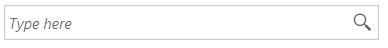
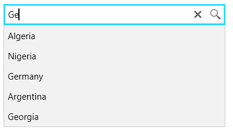
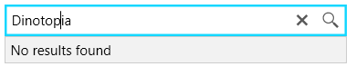
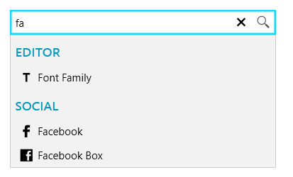

# Getting Started with {{ site.framework_name }} AutoSuggestBox

This tutorial will walk you through the creation of a sample application that contains a __RadAutoSuggestBox__ control.
			
## Assembly References

In order to use __RadAutoSuggestBox__, you will need to add references to the following assemblies:

* __Telerik.Licensing.Runtime__
* __Telerik.Windows.Controls__
* __Telerik.Windows.Controls.Input__

You can find the required assemblies for each control from the suite in the [Controls Dependencies]() help article.

>tip With the 2025 Q1 release, the Telerik UI for WPF has a new licensing mechanism. You can learn more about it [here]().

### Adding Telerik Assemblies Using NuGet

To use __RadAutoSuggestBox__ when working with NuGet packages, install the `Telerik.Windows.Controls.Input.for.Wpf.Xaml` package. The [package name may vary]() slightly based on the Telerik dlls set - [Xaml or NoXaml]()

Read more about NuGet installation in the [Installing UI for WPF from NuGet Package]() article.

## Defining RadAutoSuggestBox

RadAutoSuggestBox allows you to visualize a list of search results on demand when you enter text. When the text in the control changes, the __TextChanged__ event is fired, where you can filter the ItemsSource of the control. This will open the drop down and display the filtered items. 

In the following example you will see a sample data provider that returns a list of countries that is filtered and displayed on text changed.

#### __[C#] Example 1: Creating sample data provider__
{{region radautosuggestbox-getting-started-0}}
	public static class CountryDataProvider
	{
		private static List<CountryInfo> Countries { get; set; }

		static CountryDataProvider()
		{
			Countries = new List<CountryInfo>();
			var cultures = CultureInfo.GetCultures(CultureTypes.SpecificCultures);
			foreach (CultureInfo culture in cultures)
			{
				var regionInfo = new RegionInfo(culture.LCID);
				if (!Countries.Any(x => x.Name.Equals(regionInfo.EnglishName)))
				{
					Countries.Add(new CountryInfo() { Name = regionInfo.EnglishName });
				}
			}
		}

		public static List<CountryInfo> GetCountriesByText(string searchText)
		{
			var result = new List<CountryInfo>();
			var lowerText = searchText.ToLowerInvariant();
			return Countries.Where(x => x.Name.ToLowerInvariant().Contains(lowerText)).ToList();
		}
	}
	
	public class CountryInfo
    {
        public string Name { get; set; }
    }
{{endregion}}

#### __[XAML] Example 2: Defining RadAutoSuggestBox and subscribing to TextChanged__
{{region radautosuggestbox-getting-started-1}}
	<telerik:RadAutoSuggestBox x:Name="radAutoSuggestBox"
							   TextChanged="RadAutoSuggestBox_TextChanged"
							   DisplayMemberPath="Name" 
							   TextMemberPath="Name" 							   
							   WatermarkContent="Type here" 
							   NoResultsContent="No results found" />
{{endregion}}

#### __[C#] Example 3: Implementing filtering in the TextChanged event handler__
{{region radautosuggestbox-getting-started-2}}
	private void RadAutoSuggestBox_TextChanged(object sender, Controls.AutoSuggestBox.TextChangedEventArgs e)
	{
		if (e.Reason == TextChangeReason.UserInput)
		{
			this.radAutoSuggestBox.ItemsSource = CountryDataProvider.GetCountriesByText(this.radAutoSuggestBox.Text);
		}            
	}
{{endregion}}

The definition in __Example 2__ has few additional settings:

* __DisplayMemberPath__: Specifies the property path used to get the value displayed for each data item in the drop down of the RadAutoSuggestBox control.
* __TextMemberPath__: Specifies the property path used to get the value displayed in the TextBox of the control.
* __WatermarkContent__: Specifies the value displayed in the TextBox of the control when no text is entered.
* __NoResultsContent__: Specifies the value displayed in the drop down when no results are presented in the ItemsSource of the control.

>tip Use the __Text__ property to get or set the current query or suggestion text.

#### Figure 1: Watermark content when no text is entered

#### Figure 2: Filtered results in the drop down

#### Figure 3: No result

After selecting an item from the drop down list or click on the query icon, you can use __QuerySubmitted__ and __SuggestionChosen__ events to execute additional actions.

## Open Drop Down Manually

The drop down of the control can be opened or closed manually by setting its __IsDropDownOpen__ property.

#### __[XAML] Example 2: Setting IsDropDownOpen__
{{region radautosuggestbox-getting-started-3}}
	<telerik:RadAutoSuggestBox IsDropDownOpen="True" />
{{endregion}}

## Setting a Theme

The controls from our suite support different themes. You can see how to apply a theme different than the default one in the [Setting a Theme]() help article.

>important Changing the theme using implicit styles will affect all controls that have styles defined in the merged resource dictionaries. This is applicable only for the controls in the scope in which the resources are merged. 

To change the theme, you can follow the steps below:
* Choose between the themes and add reference to the corresponding theme assembly (ex: **Telerik.Windows.Themes.Fluent.dll**). You can see the different themes applied in the **Theming** examples from our [WPF Controls Examples](https://demos.telerik.com/wpf/) application.

* Merge the ResourceDictionaries with the namespace required for the controls that you are using from the theme assembly. For the __RadAutoSuggestBox__, you will need to merge the following resources:

	* __Telerik.Windows.Controls__
	* __Telerik.Windows.Controls.Input__

__Example 3__ demonstrates how to merge the ResourceDictionaries so that they are applied globally for the entire application.

#### __[XAML] Example 3: Merge the ResourceDictionaries__  
{{region xaml-radautosuggestbox-getting-started_4}}
	<Application.Resources>
		<ResourceDictionary>
			<ResourceDictionary.MergedDictionaries>
				<ResourceDictionary Source="/Telerik.Windows.Themes.Fluent;component/Themes/System.Windows.xaml"/>
				<ResourceDictionary Source="/Telerik.Windows.Themes.Fluent;component/Themes/Telerik.Windows.Controls.xaml"/>
				<ResourceDictionary Source="/Telerik.Windows.Themes.Fluent;component/Themes/Telerik.Windows.Controls.Input.xaml"/>
			</ResourceDictionary.MergedDictionaries>
		</ResourceDictionary>
	</Application.Resources>
{{endregion}}

>Alternatively, you can use the theme of the control via the [StyleManager](https://docs.telerik.com/devtools/wpf/styling-and-appearance/stylemanager/common-styling-apperance-setting-theme-wpf).

__Figure 2__ shows a __RadAutoSuggestBox__ with the **Fluent** theme applied.
	
#### __Figure 2: RadAutoSuggestBox with the Fluent theme__

## Customizing Appearance

RadAutoSuggestBox allows you to customize the appearance of its TextBox, buttons and items. You can read more about this in the [Customizing Appearance]() section of the control's documentation.


## Telerik UI for WPF Learning Resources

* [Telerik UI for WPF AutoSuggestBox Component](https://www.telerik.com/products/wpf/autosuggestbox.aspx)
* [Getting Started with Telerik UI for WPF Components]()
* [Telerik UI for WPF Installation]()
* [Telerik UI for WPF and WinForms Integration]()
* [Telerik UI for WPF Visual Studio Templates]()
* [Setting a Theme with Telerik UI for WPF]()
* [Telerik UI for WPF Virtual Classroom (Training Courses for Registered Users)](https://learn.telerik.com/learn/course/external/view/elearning/16/telerik-ui-for-wpf) 
* [Telerik UI for WPF License Agreement](https://www.telerik.com/purchase/license-agreement/wpf-dlw-s)


## See Also  
* [Watermark]()
* [Visual Structure]()
* [Grouping]()
* [Events]()
