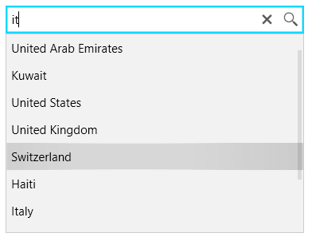

# Overview

__RadAutoSuggestBox__ is a text control that makes suggestions to the users as they type text in. When the text updates an event is fired where you can load suggestions into the drop down of the control.

## Key Features

* __Keyboard Navigation__: The control provides a built-in support for several keyboard keys. Read more in the [Keyboard Support]() article.

* __Commands Support__: The search and clear actions of RadAutoSuggestBox are implemented via commands that can be customized or replaced. Read more in the [Commands]() article.

* __Grouping__: You can enable grouping in the control via the grouping feature of [ICollectionView](https://docs.microsoft.com/en-us/dotnet/api/system.componentmodel.icollectionview?view=netframework-4.5). Read more in the [Grouping]() article.

* __Customizable Appearance__: RadAutoSuggestBox allows you to customize the appearance of its TextBox part, buttons and the drop down. Read more in the [Appearance]() section of the documentation.

* __Watermark Support__: A watermark is displayed when no text is entered in the TextBox part of the control. Read more in the [Watermark]() article.

* __Rich Set of Themes__: All Telerik WPF controls support a set of built-in themes that you can choose from. Read more in the [Style an Appearance]() section of the documentation.

>tip Get started with the control with its [Getting Started]() help article that shows how to use it in a basic scenario.

>Check out the demos at [demos.telerik.com](https://demos.telerik.com/wpf/).

## See Also   
 * [Visual Structure]() 
 * [Events]()