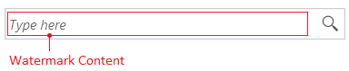
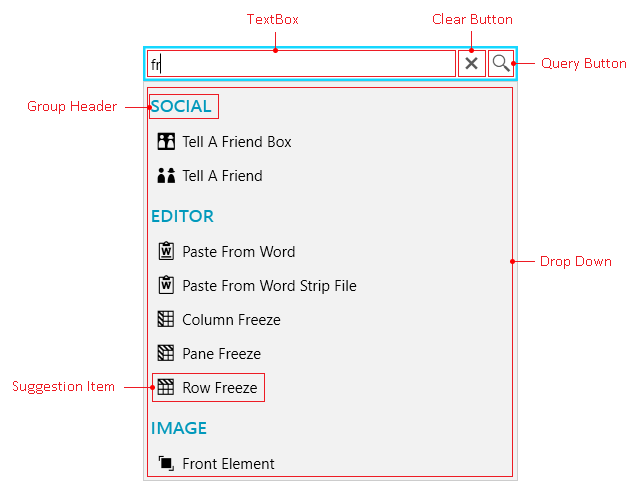
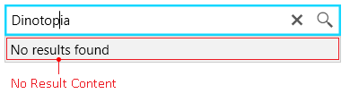

# Visual Structure

This topic defines terms and concepts related to __RadAutoSuggestBox__ that you have to get familiar with before you continue reading this help.

#### __Figure 1: RadAutoSuggestBox in the Fluent theme__
  
  

The following table lists the elements that make up a RadNavigationView:

* __Watermark Content__: Shows the empty content of RadAutoSuggestBox when there is no text enterted into the TextBox.

* __TextBox__: Shows the current text query or the chosen suggestion. 

* __Group Header__: Shows the group header when grouping is used. 

* __Suggestion Item__: An item from the ItemsSource of RadAutoSuggestBox.

* __Drop Down__: The drop down that shows the ItemsSource results.

* __Query Button__: The query button that triggers search.

* __Clear Button__: The clear button that clears the current query text or suggestion.

* __No Results Content__: The content shown in the Drop Down when you submit a query and there are not results in the ItemsSource.

## See Also  
 * [Getting Started]() 
 * [Buttons]()
 * [Watermark]()
 * [Grouping]()
