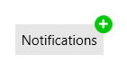

# Getting Started with {{ site.framework_name }} Badge

This tutorial will walk you through the creation of a sample application that contains a __RadBadge__ control.

## Assembly References

To use __RadBadge__, add references to the following assemblies:

* __Telerik.Licensing.Runtime__
* __Telerik.Windows.Controls__

>tip With the 2025 Q1 release, the Telerik UI for WPF has a new licensing mechanism. You can learn more about it [here]().

### Adding Telerik Assemblies Using NuGet

To use __RadBadge__ when working with NuGet packages, install the `Telerik.Windows.Controls.for.Wpf.Xaml` package. The [package name may vary]() slightly based on the Telerik dlls set - [Xaml or NoXaml]()

Read more about NuGet installation in the [Installing UI for WPF from NuGet Package]() article.

## Defining the RadBadge

#### __[C#] Defining RadBage in XAML__
{{region radbadge-getting-started-0}}
	<telerik:RadButton Content="Notifications" VerticalAlignment="Center" HorizontalAlignment="Center">
		<telerik:RadBadge.Badge>
			<telerik:RadBadge BadgeType="Add"  />
		</telerik:RadBadge.Badge>
	</telerik:RadButton>
{{endregion}}

#### Figure 1: RadBadge Example


## Telerik UI for WPF Learning Resources

* [Telerik UI for WPF BadgeControl Component](https://www.telerik.com/products/wpf/badge-control.aspx)
* [Getting Started with Telerik UI for WPF Components]()
* [Telerik UI for WPF Installation]()
* [Telerik UI for WPF and WinForms Integration]()
* [Telerik UI for WPF Visual Studio Templates]()
* [Setting a Theme with Telerik UI for WPF]()
* [Telerik UI for WPF Virtual Classroom (Training Courses for Registered Users)](https://learn.telerik.com/learn/course/external/view/elearning/16/telerik-ui-for-wpf) 
* [Telerik UI for WPF License Agreement](https://www.telerik.com/purchase/license-agreement/wpf-dlw-s)


## See Also  
* [Key Properties]()
