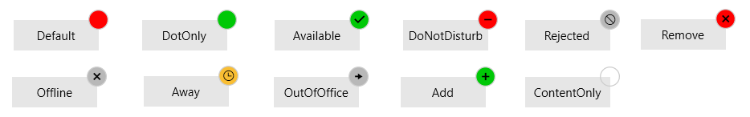

# Key Properties

This article will list the key properties provided by the RadBadge control.

* __Position__: A property of type __Point__ that gets or sets the relative position of the badge to the element which is attached to it.

	>The RadBadge control uses its center point for positioning it relative to the attached element. 

* __AnchorPosition__: A property of type __Point__ that gets or sets the __anchor position__ of the badge, relative to the size of the badge control. Default value is (0.5, 0.5).

* __PlayChangeAnimation__: A property of type __ICommand__ that gets or sets the play change animation of the badge.

* __InheritDataContext__: A property of type __bool__ that gets or sets a value indicating whether the badge should take the data context from its target element.

* __BadgeType__: A property of type __BadgeType__ that gets or sets the badge type of the badge control. The __BadgeType__ is an enumeration and it allows the following values:

	* __Default__
	* __DotOnly__
	* __Available__
	* __DoNotDisturb__
	* __Rejected__
	* __Remove__
	* __Offline__
	* __Away__
	* __OutOfOffice__
	* __Add__
	* __ContentOnly__: 	
	
#### Figure 3: RadBadge Types


* __Geometry__: A property of type __Geometry__ that gets or sets the geometry of the badge control. You can apply one of the following geometries which our geometry markup extension provides.

	* __Circle__
	* __Ellipse__
	* __Rectangle__
	* __RoundedRectangle__
	* __Square__
	* __Triangle__
	* __RightTriangle__
	* __Pentagon__
	* __Hexagon__
	* __Heptagon__
	* __Octagon__
	* __Star5__
	* __Cloud__
	* __Oval__
	
	>To set a custom geometry to the RadBadge control, the BadgeType property needs to be set to __ContentOnly__.

	__Example 1: Set Custom Geometry__
	```XAML
		<telerik:RadButton Width="85" Height="30" Content="Notifications"  VerticalAlignment="Center" HorizontalAlignment="Center">
			<telerik:RadBadge.Badge>
				<telerik:RadBadge Content="99" BadgeType="ContentOnly" Background="#FFFFC000" Geometry="{telerik:Geometry Type=Oval}" />
			</telerik:RadBadge.Badge>
		</telerik:RadButton>
	```

	To apply a custom geometry in code-behind, you can use the GeometryFactory.SetGeometry() method.

	__Example 1: Set Custom Geometry In Code__
	```C#
		public Example()
		{
			this.InitializeComponent();
			this.badge.Geometry = GeometryFactory.SetGeometry(GeometryType.Hexagon);
		}
	```
		
	#### Figure 3: Custom Geometries
	

* __TextAlignment__: A property of type __TextAlignment__ that gets or sets the text alignment of the underlying __TextBlock__.

## Change Badge Animation

By default, the RadBadge control is load and change with an animation. The load\change animations are FadeAnimation by default. If you want to change/modify the animations of the RadBadge control you can use the __AnimationManager.AnimationSelector__ attached property. The AnimationName property needs to be specified to either LoadAnimation or ChangeAnimation depending on which animation you want to change/modify.

__Example 2: Modify Badge Animations__
	```C#
		<telerik:RadButton Width="100" Height="40" Content="Oval" FontSize="14" VerticalAlignment="Center" HorizontalAlignment="Center">
			<telerik:RadBadge.Badge>
				<telerik:RadBadge Content="99"  BadgeType="ContentOnly" FontSize="16" Foreground="Black"  Background="#FFFFC000" Geometry="{telerik:Geometry Type=Oval}" >
					<telerik:AnimationManager.AnimationSelector>
						<telerik:AnimationSelector>
							<telerik:FadeAnimation AnimationName="LoadAnimation" Direction="In" SpeedRatio="0.25"  />
							<telerik:FadeAnimation AnimationName="ChangeAnimation" Direction="Out" SpeedRatio="0.25"/>
						</telerik:AnimationSelector>
					</telerik:AnimationManager.AnimationSelector>
				</telerik:RadBadge>
			</telerik:RadBadge.Badge>
		</telerik:RadButton>
	```

