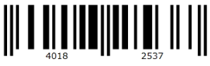
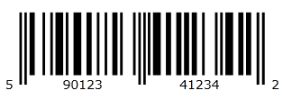

# Types Description

This help topic will give you an overview of the following barcode types:

* [Code 39](#Code_39)

* [Code EAN13](#Code_EAN13)

* [Code EAN8](#Code_EAN8)

* [Code 128](#Code_128)

* [Code UPCA](#Code_UPCA)

* [Code UPCE](#Code_UPCE)

* [Code UPCSupplement2](#Code_UPCSupplement2)

* [Code UPCSupplement5](#Code_UPCSupplement5)

## Code 39

RadBarcode39 is a control which encodes alphanumeric characters into a series of bars. It is of variable length and accepts uppercase letters, as well as numbers.It includes an optional Mod 43 checksum. 

## Code EAN13

RadBarcodeEAN13 is a control which encodes numbers into a series of bars. It is of fixed length, of 12 digits, and accepts numbers. It includes a checksum.

## Code EAN8

RadBarcodeEAN8 is a control which encodes numbers into a series of bars. It is of fixed length, of 7 digits, and accepts numbers only. It includes a checksum

## Code 128

RadBarcode128 is a control which encodes alphanumeric characters into a series of bars. It is of variable  length, and accepts numbers, upper and lower case characters. It also includes an obligatory MOD 103 checksum.

## Code UPCA

UPCA is a barcode symbology, which consists of 12 digits, one of which is a checksum.

## Code UPCE

UPCE is a barcode symbology, which consists of 12 digits, one of which is a checksum.

## Code UPCSupplement2

A two digit upc supplementary code.

## Code UPCSupplement5

A five digit upc supplementary code.

