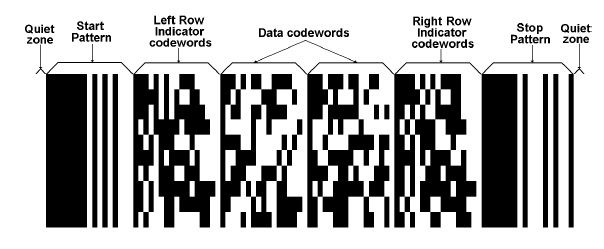

# Visual Structure

RadBarcodePdf417 is a 2D barcode, similar to the QR code.      

## Structure of PDF417

The code is divided into rows and columns, which accommodate all the encoded data, the error correction code words, as well as any additional format information, such as start and stop sequences.        

The PDF417 barcode has the following structure:  

The __Data Codewords__, are located in the middle section of the barcode, and include the following sections:
        

1. The length indicator cluster (each cluster contains 17 modules), which signifies the total length of the data code words.            

2. The actual data, which represents the data entered by the user initially, encoded.            

3. The error correction cluster(s), which help the decoder in recovering any data from the code.            

4. Padding cluster(s) – since a rectangular matrix is allocated for the data code words, it may become necessary to pad the data, and add one or more clusters, in order to fill any gaps in the available matrix.            

__The Left Row Indicator__, as well as the __Right Row Indicator__  help the decoder locate each row. Essentially the row indicators represent an encoding of the row number.        

The __Start__ and __Stop__ Patterns are present on each row in the PDF417. The signal when the data and row indicators start, and end. Each start/stop cluster is identical for each row.        

Additionally, there is a minimum of two modules on each side of the PDF417 barcode, dedicated to the quiet zone. This gives space, and separates the barcode from other visual elements on the page, allowing the reader to more reliably detect it.        

# See Also
 * [PDF417 Properties]()