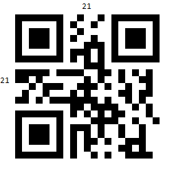
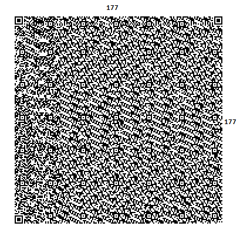
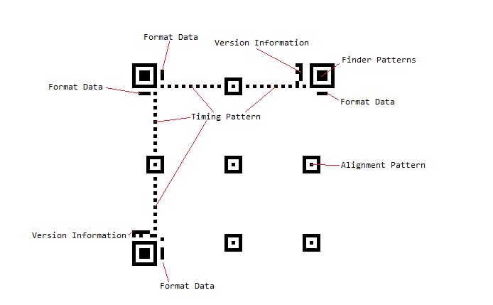
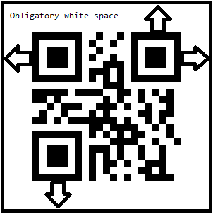

# Visual Structure

There are a total of 40 versions available in the QRCode,  from 21 by 21 modules to 177 by  177 modules, increasing in steps of 4 modules per side. Naturally, higher versions are used to encode larger amounts of data:

Disregarding the data, which consists of the actual encoded data, along with the error correction bits, the structure of the code includes the module groups listed below:

* __Finder Pattern__  
	The finder pattern is a concentric square of alternating colors, located in all corners of the symbol except the bottom right. They are used by decoders establish orientation. The center is a 3x3 black square and is surrounded by a one-module-thick white box, which is surrounded by a one-module-thick black box, making the full pattern 7x7 modules.

* __Alignment Pattern__  
	The alignment pattern is only included in the rendered QR code in version 2 and above. Its purpose is to allow the decoder to scan a skewed image, and convert it to the virtual grid of black and white modules, representing the encoded data. The alignment pattern is made of concentric squares, much like the finder patterns, with the center being a single black module.

* __Timing Pattern__  
	The timing pattern is an alternating stripe of black and white modules, starting at the lower left corner of the upper right Finder Pattern, going horizontally to the upper left finder pattern and then going vertically to the lower left finder pattern.

* __Format Data__  
	The format data is information, pertaining to the Masking rule used in the QR Code, along with error correction level. When the data in the QR code is encoded, some of the modules are inverted, in accordance with a predefined rule, in order to improve readability, and ensure that there are no big clusters of same-colored modules. This process is called masking, and the masking information is included in the format data, to alert the decoder that certain modules have been inverted.

	The format data is encoded in 15 bits. One full copy of the format data is located around the upper left finder pattern. A second copy, divided into 7 and 8 bits, is located next to the other two finder patterns.

* __Version Data__

	The version data includes information on which version the QR code is. This data is encoded into 18 modules, in a 6 by 3 matrix. Two copies of the version data matrix are included in the QR code - one next to the upper right finder pattern, and the other next to the lower left one.

* __Blank Space__

	Additionally, around each QR code, there is an obligatory 4-modules-wide white space area:

	

* __Data__

	The data occupies all available modules, not occupied by any of the formatting data segments mentioned above. If the data is smaller than the capacity of the remaining modules, it is padded, in order to ensure that all modules are used. Additionally, the data consists of the actual encoded data, entered by the user, and the error correction bits, calculated on that data.

## See Also
[Overview]()
[Getting Started]()
[QRCode Properties]()