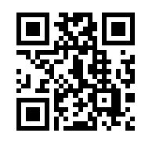

# Getting Started with {{ site.framework_name }} Barcode

This article will guide you through the steps needed to add a basic **RadBarcode** control in your application.

## Adding Telerik Assemblies Using NuGet

To use __RadBarcode__ when working with NuGet packages, install the `Telerik.Windows.Controls.DataVisualization.for.Wpf.Xaml` package. The [package name may vary]() slightly based on the Telerik dlls set - [Xaml or NoXaml]()

Read more about NuGet installation in the [Installing UI for WPF from NuGet Package]() article.

>tip With the 2025 Q1 release, the Telerik UI for WPF has a new licensing mechanism. You can learn more about it [here]().

## Adding Assembly References Manually

If you are not using NuGet packages, you can add a reference to the following assemblies:

* __Telerik.Licensing.Runtime__
* __Telerik.Windows.Controls__
* __Telerik.Windows.Controls.DataVisulization__
* __Telerik.Windows.Data__

You can find the required assemblies for each control from the suite in the [Controls Dependencies]() help article.

## Defining a Barcode

If your app is setup, you are ready to add a **RadBarcode** control to it. __Example 1__ demonstrates a QRCode symbology. For more details on the available Barcode symbologies go to the [Supported Types]() topic.

__Example 1: Defining a RadBarcode__
```XAML
	<telerik:RadBarcode Value="https://www.telerik.com/wpf"  Height="200" Width="200" x:Name="barcode">
		<telerik:RadBarcode.Symbology>
			<telerik:QRCode />
		</telerik:RadBarcode.Symbology>
	</telerik:RadBarcode>
```

#### Figure 1: Barcode Getting Started



## Telerik UI for WPF Learning Resources

* [Telerik UI for WPF Barcode Component](https://www.telerik.com/products/wpf/barcode.aspx)
* [Getting Started with Telerik UI for WPF Components]()
* [Telerik UI for WPF Installation]()
* [Telerik UI for WPF and WinForms Integration]()
* [Telerik UI for WPF Visual Studio Templates]()
* [Setting a Theme with Telerik UI for WPF]()
* [Telerik UI for WPF Virtual Classroom (Training Courses for Registered Users)](https://learn.telerik.com/learn/course/external/view/elearning/16/telerik-ui-for-wpf) 
* [Telerik UI for WPF License Agreement](https://www.telerik.com/purchase/license-agreement/wpf-dlw-s)


## See Also

- [Key Features]()
- [Supported Barcodes]()
