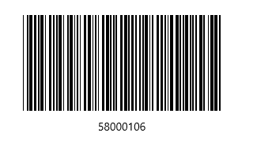
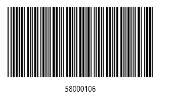

# Key Features

The purpose of this help article is to show you the key features of the **RadBarcode** control. 

## Setting Barcode Value

RadBarcode exposes a **Value** property that is used to set the barcode data presented by the control. The **Value** of the barcode is of type string and the allowed length depends on the symbology you choose.

## Setting the Symbology

Through the **Symbology** property you could set the symbology that will be used to convert the Value of the control into a visual barcode representation.  RadBarcode supports the most commonly used symbologies such as:

* EAN13  
* EAN8  
* UPC-A  
* UPC-E  
* Code39  
* QRCode  
* PDF417   

>For more details on the available symbologies go to [Supported Types]() topic.

__Example 1__ shows a RadBarcode with the Code39 symbology applied.

__Example 1: Code39 Symbology__
```XAML
	<telerik:RadBarcode Width="250" Height="150" Value="58000106" Foreground="Black" 
									HorizontalAlignment="Center" VerticalAlignment="Center">
		<telerik:RadBarcode.Symbology>
			<telerik:Code39 HorizontalTextAlignment="Center"
							SizingMode="Stretch" 
							ShowText="True"  
							CodeTextSpacing="10"/>
		</telerik:RadBarcode.Symbology>
	</telerik:RadBarcode>
```

#### Figure 1: RadBarcode With 1D Code39 Symbology


	
## Defining the Sizing Mode

RadBarcode provides three sizing modes that will help you fine-tune the rendering of your codes:

* __Manual__: You could define the size of the smallest line or dot of the code through the Module property and the other lines and dots multiply that size. Module property is measured in device pixels.
* __Snap__: The code is stretched to the available size, but each line or dot is drawn with exact number of pixels so they look sharp. If the number of bars is greater than the pixel width of the barcode, the barcode won't get rendered to avoid wrong visualization.  
* __Stretch__: The code is stretched in such a way to fit exactly the available size, each line or dot size is calculated so they snap to the device pixels. In order the lines to stay sharp and stretch the barcode to the available size, some of them are slightly thicker than others.

__Example 2__ shows the same Barcode with Manual SizingMode:

__Example 2: Code39 SizingMode__
```XAML
	<telerik:RadBarcode Width="250" Height="150" Value="58000106" Foreground="Black" 
									HorizontalAlignment="Center" VerticalAlignment="Center">
		<telerik:RadBarcode.Symbology>
			<telerik:Code39 HorizontalTextAlignment="Center" 
						SizingMode="Manual"
						Module="2" 
						ShowText="True"  
						CodeTextSpacing="10"/>
		</telerik:RadBarcode.Symbology>
	</telerik:RadBarcode>
```

#### Figure 2: Barcode with Manual SizingMode



## Setting AutoCheckSum

By default, RadBarcode control automatically adds a checksum at the end of the barcode. You could disable this by setting **AutoCheckSum** property of its Symbology to false.  

>If you disable the AutoCheckSum feature, you would need to manually add a checksum to ensure the reliability of the barcode symbol.

## Changing the Colors

You could easily change the visual appearance of your Barcodes in order to match your application theme through **ForegroundColor** and **BackgroundColor** properties.

__Example 3: Changing the colors__
```XAML
	<telerik:RadBarcode Width="250" Height="150" Foreground="DarkBlue" Background="Beige"
                                HorizontalAlignment="Center" VerticalAlignment="Center"                               
                                Value="58000106">
		<telerik:RadBarcode.Symbology>
			<telerik:Code39 SizingMode="Stretch" />
		</telerik:RadBarcode.Symbology>
	</telerik:RadBarcode>
```

#### Figure 3: Barcode With Customized Colors


## See Also

- [Supported Types]()
