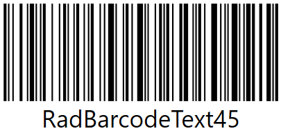
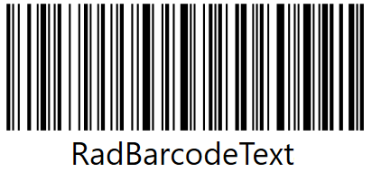

# Getting Started

The RadBarcode suite contains a set of controls that allows you to display different barcodes. This article will walk you through the creating a simple application that contains __RadBarcode128__ control. The same principle can be used to set up the other controls from the suite.

* [Assembly References](#assembly-references)
* [Defining the Control and Setting Data](#defining-the-control-and-setting-data)
* [Showing the Text](#showing-the-text)
* [Showing the Checksum](#showing-the-checksum)
* [Restricting the Aspect Ratio](#restricting-the-aspect-ratio)

## Assembly References

In order to use the controls from the RadBarcode suite, you will need to add references to the following assemblies:
* __Telerik.Windows.Controls__
* __Telerik.Windows.Controls.DataVisualization__
* __Telerik.Windows.Data__

## Defining the Control and Setting Data

The barcode controls work with text data. After the control is defined (see Example 1) you can set the data via its __Text__ property.

> If you data bind the Text property and want the UI to be updated when the view model property is changed you will need to set the __binding Mode__ to __TwoWay__.

#### __[XAML] Example 1: Defining the control__
{{region radbarcode-getting-started-0}}
	<telerik:RadBarcode128 Text="RadBarcodeText" />
{{endregion}}

#### __Figure 1: RadBarcode128__

## Showing the Text

By default the control displays the value of the Text property under the barcode. You can show or hide this via the __ShowText__ property.

#### __[XAML] Example 2: Hiding the text__
{{region radbarcode-getting-started-1}}
	<telerik:RadBarcode128 Text="RadBarcodeText" ShowText="False" />
{{endregion}}

## Showing the Checksum

By default the barcode includes the checksum in the rendered barcode image. To change this you can set the __RenderChecksum__ property to __False__.

#### __[XAML] Example 3: Removing the checksum from the rendered image__
{{region radbarcode-getting-started-2}}
	<telerik:RadBarcode128 Text="RadBarcodeText" RenderChecksum="False" />
{{endregion}}

By default the checksum is shown in the text field under the barcode. To change this you can set the __ShowChecksum__ property to __False__. 

#### __[XAML] Example 4: Hiding the checksum__
{{region radbarcode-getting-started-3}}
	<telerik:RadBarcode128 Text="RadBarcodeText" ShowChecksum="False" />
{{endregion}}

#### __Figure 1: RadBarcode128 with shown checksum__

## Restricting the Aspect Ratio

The control allows you to restrict its aspect ratio. You can do that by setting the __RestrictAspectRatio__ property to __True__. The ratio is __4 to 1__, which means that the Width of the control will be 4 times its Height. For example, if you set Width of 400, the Height will be 100.

#### __[XAML] Example 4: Restricting the aspect ratio__
{{region radbarcode-getting-started-4}}
	<telerik:RadBarcode128 Text="RadBarcodeText" RestrictAspectRatio="True" />
{{endregion}}

## See Also
* [RadBarcodeQR]()
* [1D Barcodes Specifications]()
