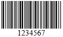
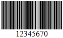
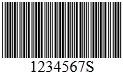
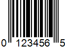

# 1D Barcode Specifications

One dimensional (1D) barcodes are made up of lines and spaces of various widths that create specific patterns.

The following table describes the specific characteristics of the bar codes per type.

|Barcode type|Image|Description|Character Set|Length|Check Digit|
|----|----|----|----|----|----|
|**Codabar**||Codabar is a discrete, self-checking symbology that may encode 16 different characters,plus an additional 4 start/stop characters.|0123456789-$:/.+|variable (no fixed length)|Calculated according to Modulo 16|
|**Code 11**||Code11 is a barcode symbology which is discrete and is able to encode the numbers 0 through to 9, the dash symbol (-), and start/stop characters|0123456789-|variable (no fixed length)|Calculated according to Modulo 11|
|**Code 25 Standard**||Standard 2 of 5 is a low-density numeric symbology. The spaces in the barcode exist only to separate the bars themselves. Additionally, a bar may either be wide or narrow, a wide bar generally being 3 times as wide as a narrow bar. The exact size of the spaces is not critical, but is generally the same width as a narrow bar.|0123456789|variable (no fixed length)|Calculated according to Modulo 10|
|**Code 25 Interleaved**||Interleaved 2 of 5 is a higher-density numeric symbology based upon the Standard 2 of 5 symbology.Interleaved 2 of 5 encodes any even number of numeric characters in the widths of the bars and spaces of the bar code.Unlike Standard 2 of 5, which only encodes information in the width of the bars,Interleaved 2 of 5 encodes data in the width of both the bars and spaces. This allows Interleaved 2 of 5 to achieve a somewhat higher density.The symbology is called "interleaved" because the first numeric data is encoded in the first 5 bars while the second numeric data is encoded in the first 5 spaces that separate the first 5 bars.Thus the first 5 bars and spaces actually encode two characters. This is also why the bar code can only encode an even number of data elements.|0123456789|variable (no fixed length), but even|Calculated according to Modulo 10|
|**Code 39**||Code39 is a barcode symbology which encodes alphanumeric characters into a series of bars. It is of variable length and accepts uppercase letters, as well as numbers.It includes an optional Mod 43 checksum.|0123456789[Space] ABCDEFGHIJKLMNO PQRSTUVWXYZ-.$/+%|variable (no fixed length)|Calculated according to Modulo 43|
|**Code 39 Extended**||Code39Extended is an exteded version of code 39, which includes a bigger character set. If there is a requirement to use the Code39 barcode with characters other than numbers and uppercase alphabets, then this is the recommended barcode.|0123456789[Space] ABCDEFGHIJKLMNO PQRSTUVWXYZ!#$%&'() *+,-./:;<=>?@[\]^_` abcdefghijklmnopqrstuvwxyz{&#124;}|variable (no fixed length)|Calculated according to Modulo 43|
|**Code 93**||Code93 was designed to complement and improve upon Code 39. Code 93 is similar in that it,like Code 39, can represent the full ASCII character set by using combinations of 2 characters.It differs in that Code 93 is a continuous symbology and produces denser code. It also encodes 47characters compared to Code 39's 43 characters. |0123456789[Space]ABCDEFGHIJKL MNOPQRSTUVWXYZ-.$/+%|variable (no fixed length)|Calculated according to Modulo 47|
|**Code 93 Extended**||Code93Extended is an exteded version of code 93, which includes a bigger character set. Code93Extended can encode full 128 character ASCII using the four additional characters: ($) (%) (/) (+)|0123456789[Space]ABCDEFGHIJKL MNOPQRSTUVWXYZ -.$/+%!#&'()*,:;<=>?@[\]^_` abcdefghijklmnopqrstuvwxyz{&#124;}~|variable (no fixed length)|Calculated according to Modulo 47|
|**Code 128**||Code128 is a barcode symbology which encodes alphanumeric characters into a series of bars. It is of variable length, and accepts numbers, upper and lower case characters. It also includes an obligatory MOD 103 checksum. The Code128 is divided into three subsets A, B, and C. There are three separate start codes to indicate which subset will be used.|!"#$%&''()*+,-./ 0123456789:;<=>?@ ABCDEFGHIJKLMNO PQRSTUVWXYZ[\]^_` abcdefghijklmnopqrstuvwxyz{&#124;}Space, Control characters: ASCII 1-31,127|variable (no fixed length)|Calculated according to Modulo 103|
|**Code 128 A**||Code128A supports the standard ASCII symbols, numbers, upper case letters, and control characters,such as tab and new-line.||||
|**Code 128 B**||Code128B supports standard ASCII symbols, numbers, upper and lower case letters.||||
|**Code 128 C**||Code128C supports numbers only.||||
|**MSI**||MSI(also known as Modified Plessey) is a barcode symbology, a continuous, non-self-checking symbology. It is used primarily for inventory control, marking storage containers and shelves in warehouse environments. The length of this barcode type is variable.|01234567890|variable (no fixed length)|The MSI barcode uses one of four possible schemes for calculating a check digit: MSImod10(most common), MSImod1010, MSImod11, MSImod1110|
|**EAN 8**||EAN8 is a barcode symbology which encodes numbers into a series of bars. It is of fixed length, of 7 digits, and accepts numbers only. It includes a checksum.|01234567890|8|Calculated according to Modulo 10|
|**EAN 13**||EAN13 is a barcode symbology which encodes numbers into a series of bars.It is of fixed length, of 13 digit (12 data and 1 check), and accepts numbers. First digit is always placed outside the symbol; additionally a right quiet zone indicator (>) is used to indicate Quiet Zones that are necessary for barcode scanners to work properly. It includes a checksum.|01234567890|13|Calculated according to Modulo 10|
|**Postnet**||Postnet(Postal Numeric Encoding Technique) is a barcode symbology which encodes numbers into a series of bars. It is of variable length and accepts numbers only. It includes a checksum. The POSTNET barcode was replaced by the Intelligent Mail barcode in the fall of 2009.|01234567890|variable (no fixed length)|The check digit is calculated as follows: First add all digits. The difference of this sum to the next multiple of 10 is the check digit.|
|**Planet**||The Postal Alpha Numeric Encoding Technique (PLANET) barcode was used by the United States Postal Service to identify and track pieces of mail during delivery - the Post Office's "CONFIRM" services. It was fully superseded by Intelligent Mail Barcode by January 28, 2013.|0123456789|A PLANET barcode appears either 12 or 14 digits long.|Calculated according to Modulo 10|
|**Intelligent Mail**||The Intelligent Mail Barcode (IM barcode) is a 65-bar barcode for use on mail in the United States. The IM barcode is intended to provide greater information and functionality than its predecessors POSTNET and PLANET. |numeric|20, 25, 29 or 31|CRC check|
|**UPC A**||**UPC A** is a barcode symbology, which consists of 12 digits, one of which is a checksum. This barcode identifies the manufacturer and specific product, so point-of-sale cash register systems can automatically look up the price.|01234567890|12 bzw. 8|Calculated according to Modulo 10|
|**UPC E**||**UPC E** is an 8-digit long variation of the UPCA symbol that is used for number system 0. By suppressing zeroes, UPCE codes can be printed in a very small space and are used for labeling small items.|01234567890|8|Calculated according to Modulo 10|
|**UPC Supplement 2**||A two digit UPC supplementary code. This barcode should only be used with magazines, newspapers and other such periodicals.|0123456789|2|none|
|**UPC Supplement 5**||A five digit UPC supplementary code. This barcode is used on books to indicate a suggested retail price.|0123456789|5|none|

## See Also

- [Key Features]()
- [Supported Barcodes]()
