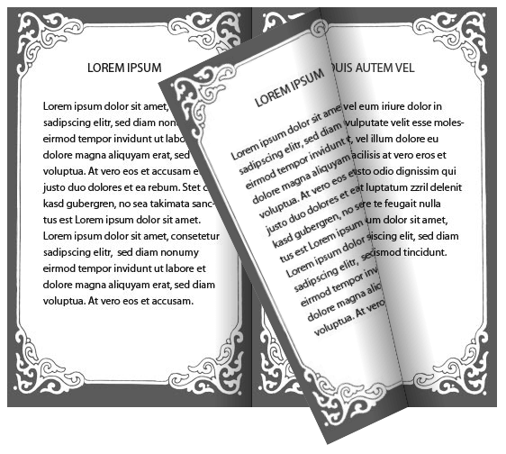

# Hard Pages

To enable hard paper functionality, you have to set the __HardPages__ property. The __HardPages__ property is an enum with the following values:

* __None__: None of the pages has the hard paper feature turned on

* __First__: Only the first page has the hard paper feature turned on

* __Last__: Only the last page has the hard paper feature turned on

* __FirstAndLast__: The first and last pages have the hard paper feature turned on

* __All__: All the pages have the hard paper feature turned on

* __Custom__: Only certain pages have the hard paper feature turned on. It is up to the user to define which pages by setting the __IsHardPaper__ property of the __RadBookItem__.

#### __[XAML] Example 1: Setting the hard pages mode to All__  
{{region xaml-book-hard-pages_0}}
	 <FrameworkElement.Resources>
	  <DataTemplate x:Key="LeftPageTemplate">
	   <Grid>
	    <Image Source="page1.jpg" Stretch="None" />
	   </Grid>
	  </DataTemplate>
	  <DataTemplate x:Key="RightPageTemplate">
	   <Grid>
	    <Image Source="page2.jpg" Stretch="None" />
	   </Grid>
	  </DataTemplate>
	 </FrameworkElement.Resources>
	 <!-- -->
	 <Grid x:Name="LayoutRoot" Background="White">
	  <telerik:RadBook x:Name="book1" Width="544" Height="444"
	    LeftPageTemplate="{StaticResource LeftPageTemplate}"
	    RightPageTemplate="{StaticResource RightPageTemplate}" FirstPagePosition="Right"
	    HardPages="All" />
	 </Grid>
{{endregion}}

#### __[XAML] Example 2: Setting the hard pages mode to Custom__  
{{region xaml-book-hard-pages_1}}
	<telerik:RadBook x:Name="book2" Width="544" Height="444" FirstPagePosition="Right"
	    RightPageIndex="0" HardPages="Custom">
	 <telerik:RadBookItem IsHardPaper="True">
	  <Grid>
	   <Image Source="page1.jpg" Stretch="None" />
	  </Grid>
	 </telerik:RadBookItem>
	 <telerik:RadBookItem IsHardPaper="True">
	  <Grid>
	   <Image Source="page2.jpg" Stretch="None" />
	  </Grid>
	 </telerik:RadBookItem>
	 <telerik:RadBookItem>
	  <Grid>
	   <Image Source="page1.jpg" Stretch="None" />
	  </Grid>
	 </telerik:RadBookItem>
	 <telerik:RadBookItem>
	  <Grid>
	   <Image Source="page2.jpg" Stretch="None" />
	  </Grid>
	 </telerik:RadBookItem>
	 <telerik:RadBookItem IsHardPaper="True">
	  <Grid>
	   <Image Source="page1.jpg" Stretch="None" />
	  </Grid>
	 </telerik:RadBookItem>
	 <telerik:RadBookItem IsHardPaper="True">
	  <Grid>
	   <Image Source="page2.jpg" Stretch="None" />
	  </Grid>
	 </telerik:RadBookItem>
	</telerik:RadBook>
{{endregion}}

