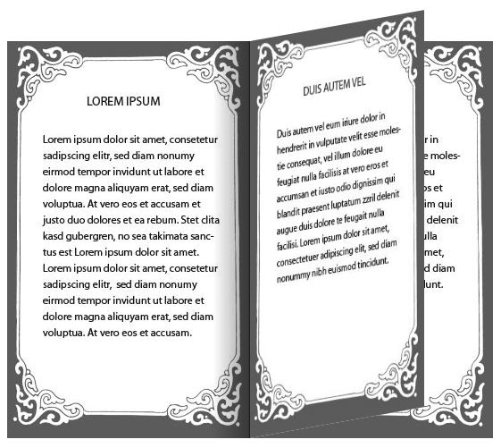
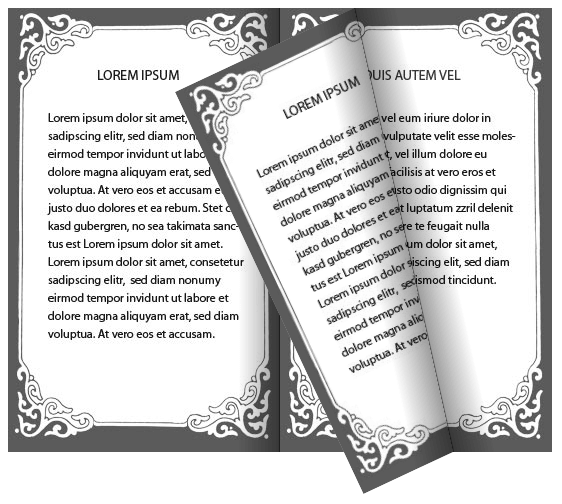

# Hard Pages

To enable hard paper functionality, you have to set the __HardPages__ property. The __HardPages__ property is an enum with the following values:

* __None__: None of the pages has the hard paper feature turned on

* __First__: Only the first page has the hard paper feature turned on

* __Last__: Only the last page has the hard paper feature turned on

* __FirstAndLast__: The first and last pages have the hard paper feature turned on

* __All__: All the pages have the hard paper feature turned on

* __Custom__: Only certain pages have the hard paper feature turned on. It is up to the user to define which pages by setting the __IsHardPaper__ property of the __RadBookItem__.

__Example 1: Setting the hard pages mode to All__  
<snippet id='radbook-features-book-hard-pages-block_1-xaml' />

__Example 2: Setting the hard pages mode to Custom__  
<snippet id='radbook-features-book-hard-pages-block_2-xaml' />

