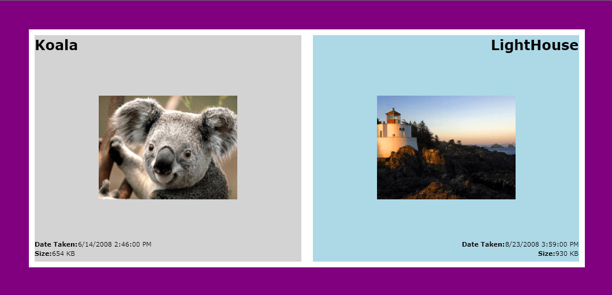

# Data Binding and Data Templates

__RadBook__ is an __ItemsControl__ and can be populated by using its __ItemsSource__ property.

__RadBook__ contains two additional properties used for templating:

* __LeftPageTemplate__ - defines a data template for all left pages.

* __RightPageTemplate__ - defines a data template for all right pages.

Below is an example of how to bind __RadBook__ to a collection of items that display photos and info.

__Example 1: Setting up the ItemsSource of RadBook__  
```C#
	public partial class MainPage : UserControl
	{
		public MainPage()
		{
			InitializeComponent();

			// create the collection of photos
			ObservableCollection<PhotoItem> myPhotos = new ObservableCollection<PhotoItem>();
			myPhotos.Add(new PhotoItem()
			{
				Title = "Chrysanthemum",
				Image = "Chrysanthemum.jpg",
				DateTaken = DateTime.Parse("3/14/2008 1:59 PM"),
				Size = "858 KB"
			});
			myPhotos.Add(new PhotoItem()
			{
				Title = "Desert",
				Image = "Desert.jpg",
				DateTaken = DateTime.Parse("2/12/2008 3:12 PM"),
				Size = "458 KB"
			});
			myPhotos.Add(new PhotoItem()
			{
				Title = "Hydrangeas",
				Image = "Hydrangeas.jpg",
				DateTaken = DateTime.Parse("3/25/2008 2:22 PM"),
				Size = "843 KB"
			});
			myPhotos.Add(new PhotoItem()
			{
				Title = "Jellyfish",
				Image = "Jellyfish.jpg",
				DateTaken = DateTime.Parse("1/14/2008 4:32 PM"),
				Size = "456 KB"
			});
			myPhotos.Add(new PhotoItem()
			{
				Title = "Koala",
				Image = "Koala.jpg",
				DateTaken = DateTime.Parse("6/14/2008 2:46 PM"),
				Size = "654 KB"
			});
			myPhotos.Add(new PhotoItem()
			{
				Title = "LightHouse",
				Image = "LightHouse.jpg",
				DateTaken = DateTime.Parse("8/23/2008 3:59 PM"),
				Size = "930 KB"
			});
			myPhotos.Add(new PhotoItem()
			{
				Title = "Penguis",
				Image = "Penguis.jpg",
				DateTaken = DateTime.Parse("3/14/2008 1:59 PM"),
				Size = "623 KB"
			});
			RadBook1.ItemsSource = myPhotos;
		}
	}
	// create a class representing a single photo
	public class PhotoItem
	{
		public string Image { get; set; }
		public string Title { get; set; }
		public DateTime DateTaken { get; set; }
		public string Size { get; set; }
	}
```
```VB.NET
	Partial Public Class MainPage
			Inherits UserControl
			Public Sub New()
				InitializeComponent()
				' create the collection of photos '
				Dim myPhotos As New ObservableCollection(Of PhotoItem)()
				myPhotos.Add(New PhotoItem() With {.Title = "Chrysanthemum", .Image = "Chrysanthemum.jpg", .DateTaken = Date.Parse("3/14/2008 1:59 PM"), .Size = "858 KB"})
				myPhotos.Add(New PhotoItem() With {.Title = "Desert", .Image = "Desert.jpg", .DateTaken = Date.Parse("2/12/2008 3:12 PM"), .Size = "458 KB"})
				myPhotos.Add(New PhotoItem() With {.Title = "Hydrangeas", .Image = "Hydrangeas.jpg", .DateTaken = Date.Parse("3/25/2008 2:22 PM"), .Size = "843 KB"})
				myPhotos.Add(New PhotoItem() With {.Title = "Jellyfish", .Image = "Jellyfish.jpg", .DateTaken = Date.Parse("1/14/2008 4:32 PM"), .Size = "456 KB"})
				myPhotos.Add(New PhotoItem() With {.Title = "Koala", .Image = "Koala.jpg", .DateTaken = Date.Parse("6/14/2008 2:46 PM"), .Size = "654 KB"})
				myPhotos.Add(New PhotoItem() With {.Title = "LightHouse", .Image = "LightHouse.jpg", .DateTaken = Date.Parse("8/23/2008 3:59 PM"), .Size = "930 KB"})
				myPhotos.Add(New PhotoItem() With {.Title = "Penguis", .Image = "Penguis.jpg", .DateTaken = Date.Parse("3/14/2008 1:59 PM"), .Size = "623 KB"})
				RadBook1.ItemsSource = myPhotos
			End Sub
		End Class
		' create a class representing a single photo '
		Public Class PhotoItem
			Public Property Image() As String
			Public Property Title() As String
			Public Property DateTaken() As Date
			Public Property Size() As String
		End Class
```

__Example 2: Binding RadBook to a collection of business objects__  
```XAML
	    <Grid x:Name="LayoutRoot" Background="Purple">
	        <Grid.Resources>
	            <!--  Declare the template used for the left pages  -->
	            <DataTemplate x:Key="LeftPageTemplate">
	                <StackPanel Margin="10" Background="LightGray">
	                    <TextBlock FontSize="24" 
	                               FontWeight="Bold"
	                               Text="{Binding Title}" />
	                    <Image Width="240" 
	                           Height="320"
	                           Source="{Binding Image}" />
	                    <StackPanel HorizontalAlignment="Stretch" Orientation="Horizontal">
	                        <TextBlock FontWeight="Bold" Text="Date Taken:" />
	                        <TextBlock Text="{Binding DateTaken}" />
	                    </StackPanel>
	                    <StackPanel HorizontalAlignment="Stretch" Orientation="Horizontal">
	                        <TextBlock FontWeight="Bold" Text="Size:" />
	                        <TextBlock Text="{Binding Size}" />
	                    </StackPanel>
	                </StackPanel>
	            </DataTemplate>
	            <!--  Declare the template used for the right pages  -->
	            <DataTemplate x:Key="RightPageTemplate">
	                <StackPanel Margin="10" Background="LightBlue">
	                    <TextBlock HorizontalAlignment="Right" 
	                               FontSize="24"
	                               FontWeight="Bold"
	                               Text="{Binding Title}" />
	                    <Image Width="240" 
	                           Height="320"
	                           Source="{Binding Image}" />
	                    <StackPanel HorizontalAlignment="Right" Orientation="Horizontal">
	                        <TextBlock FontWeight="Bold" Text="Date Taken:" />
	                        <TextBlock Text="{Binding DateTaken}" />
	                    </StackPanel>
	                    <StackPanel HorizontalAlignment="Right" Orientation="Horizontal">
	                        <TextBlock FontWeight="Bold" Text="Size:" />
	                        <TextBlock Text="{Binding Size}" />
	                    </StackPanel>
	                </StackPanel>
	            </DataTemplate>
	        </Grid.Resources>
	        <telerik:RadBook x:Name="RadBook1" 
	                         Margin="50"
	                         LeftPageTemplate="{StaticResource LeftPageTemplate}"
	                         RightPageTemplate="{StaticResource RightPageTemplate}" />
	    </Grid>
```



## See Also
 * [Getting Started]()
 * [Navigating]()