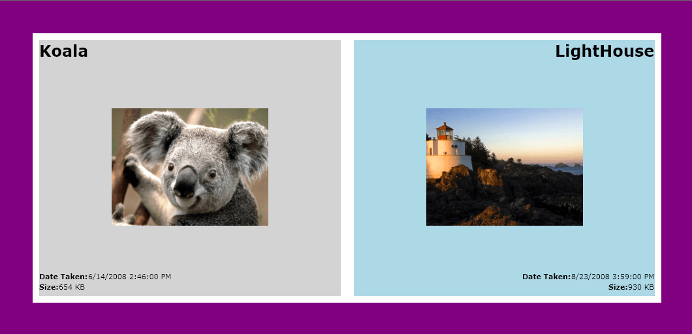

# Data Binding and Data Templates

__RadBook__ is an __ItemsControl__ and can be populated by using its __ItemsSource__ property.

__RadBook__ contains two additional properties used for templating:

* __LeftPageTemplate__ - defines a data template for all left pages.

* __RightPageTemplate__ - defines a data template for all right pages.

Below is an example of how to bind __RadBook__ to a collection of items that display photos and info.

__Example 1: Setting up the ItemsSource of RadBook__  
<snippet id='radbook-features-data-templates-block_1-cs' />
<snippet id='radbook-features-data-templates-block_1-vb' />

__Example 2: Binding RadBook to a collection of business objects__  
<snippet id='radbook-features-data-templates-block_2-xaml' />

## See Also
 * [Getting Started]()
 * [Navigating]()
