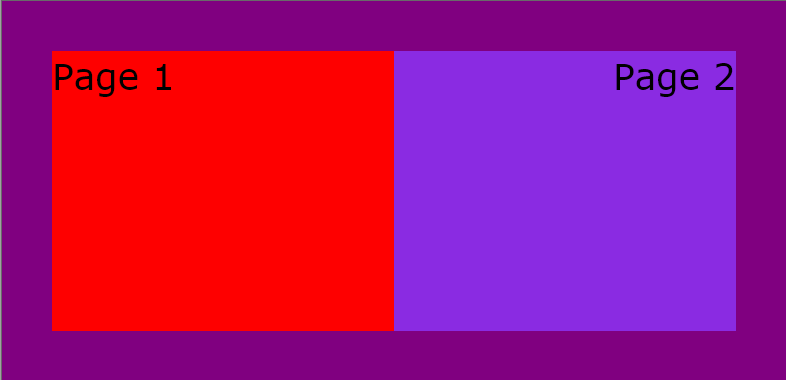
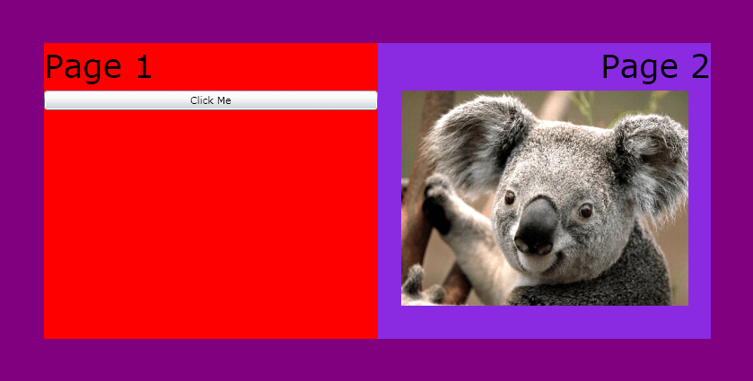
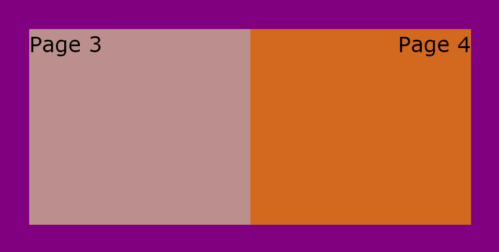

# Getting Started with {{ site.framework_name }} Book

This article will walk you through defining and using a RadBook control.

## Assembly References

In order to use the __RadBook__ control in your projects you have to add references to the following assemblies:

* __Telerik.Licensing.Runtime__
* __Telerik.Windows.Controls__
* __Telerik.Windows.Controls.Navigation__ 

* __Telerik.Windows.Data__  


You can find the required assemblies for each control from the suite in the [Controls Dependencies]()[Controls Dependencies]() help article.

>tip With the 2025 Q1 release, the Telerik UI for WPF has a new licensing mechanism. You can learn more about it [here]().

### Adding Telerik Assemblies Using NuGet

To use __RadBook__ when working with NuGet packages, install the `Telerik.Windows.Controls.Navigation.for.Wpf.Xaml` package. The [package name may vary]() slightly based on the Telerik dlls set - [Xaml or NoXaml]()

Read more about NuGet installation in the [Installing UI for WPF from NuGet Package]() article.

## Define a RadBook control

__RadBook__ is an __ItemsControl__. The pages of the book are represented by the __RadBookItem__ control. __RadBookItem__ is a __ContentControl__. Below is a basic declaration of __RadBook__ with several pages:

#### __[XAML] Example 1: Defining a RadBook__  
{{region xaml-radbook-getting-started_0}}
	<telerik:RadBook Margin="50">
		<telerik:RadBookItem Background="Red">
			<TextBlock Text="Page 1" FontSize="36"/>
		</telerik:RadBookItem>
		<telerik:RadBookItem Background="BlueViolet">
			<TextBlock Text="Page 2" HorizontalAlignment="Right" FontSize="36"/>
		</telerik:RadBookItem>
		<telerik:RadBookItem Background="RosyBrown">
			<TextBlock Text="Page 3" FontSize="36"/>
		</telerik:RadBookItem>
		<telerik:RadBookItem Background="Chocolate">
			<TextBlock Text="Page 4" HorizontalAlignment="Right" FontSize="36"/>
		</telerik:RadBookItem>
	</telerik:RadBook>
{{endregion}}

This is the result of the above code:

## Adding content to the pages of the Book

You can add any UIElement as a content of the pages. RadBookItem has a Content property which you can populate with a single root panel which contains the page content.

#### __[XAML] Example 2: Adding RadBookItems__  
{{region xaml-radbook-getting-started_1}}
	<telerik:RadBook Margin="50">
		<telerik:RadBookItem Background="Red">
			<StackPanel>
				<TextBlock Text="Page 1" FontSize="36"/>
				<Button Content="Click Me"/>
			</StackPanel>
		</telerik:RadBookItem>
		<telerik:RadBookItem Background="BlueViolet">
			<StackPanel>
				<TextBlock Text="Page 2" HorizontalAlignment="Right" FontSize="36"/>
				<Image Source="Koala.jpg" Width="320" Height="240"/>
			</StackPanel>
		</telerik:RadBookItem>
		<telerik:RadBookItem Background="RosyBrown">
			<TextBlock Text="Page 3" FontSize="36"/>
		</telerik:RadBookItem>
		<telerik:RadBookItem Background="Chocolate">
			<TextBlock Text="Page 4" HorizontalAlignment="Right" FontSize="36"/>
		</telerik:RadBookItem>
	</telerik:RadBook>
{{endregion}}

## Setting the initial page

To set the initial page that will be displayed - set the __RightPageIndex__ property:

#### __[XAML] Example 3: Setting the intially displayed page__  
{{region xaml-radbook-getting-started_2}}
	<telerik:RadBook Margin="50" x:Name="RadBook1" RightPageIndex="3">
		<telerik:RadBookItem Background="Red">
			<StackPanel>
				<TextBlock Text="Page 1" FontSize="36"/>
				<Button Content="Click Me"/>
			</StackPanel>
		</telerik:RadBookItem>
		<telerik:RadBookItem Background="BlueViolet">
			<StackPanel>
				<TextBlock Text="Page 2" HorizontalAlignment="Right" FontSize="36"/>
				<Image Source="Koala.jpg" Width="320" Height="240"/>
			</StackPanel>
		</telerik:RadBookItem>
		<telerik:RadBookItem Background="RosyBrown">
			<TextBlock Text="Page 3" FontSize="36"/>
		</telerik:RadBookItem>
		<telerik:RadBookItem Background="Chocolate">
			<TextBlock Text="Page 4" HorizontalAlignment="Right" FontSize="36"/>
		</telerik:RadBookItem>
	</telerik:RadBook>
{{endregion}}


## Telerik UI for WPF Learning Resources

* [Telerik UI for WPF Book Component](https://www.telerik.com/products/wpf/book.aspx)
* [Getting Started with Telerik UI for WPF Components]()
* [Telerik UI for WPF Installation]()
* [Telerik UI for WPF and WinForms Integration]()
* [Telerik UI for WPF Visual Studio Templates]()
* [Setting a Theme with Telerik UI for WPF]()
* [Telerik UI for WPF Virtual Classroom (Training Courses for Registered Users)](https://learn.telerik.com/learn/course/external/view/elearning/16/telerik-ui-for-wpf) 
* [Telerik UI for WPF License Agreement](https://www.telerik.com/purchase/license-agreement/wpf-dlw-s)


## See Also
 * [Data Binding and Data Templates]()
 * [Events]()
 * [Page Flip Mode]()
