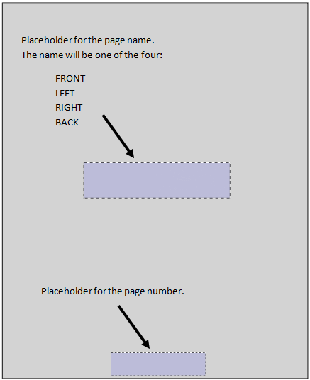
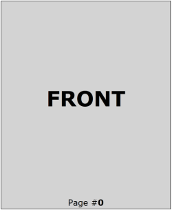
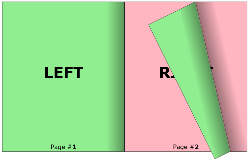

# How to apply different templates for front and back cover page

Currently __RadBook__ does not expose separate properties for setting templates for the front and back cover pages(first and last pages in RadBook's items collection). In this case, you can use the already available __DataTemplateSelectors__ - __LeftPageTemplateSelector__ and __RightPageTemplateSelector__. Depending on the index of each page, we will decide what template to apply on the page.

First, lets begin by creating 4 different templates:

* front cover page template

* left inner page template

* right inner page template

* back cover page template

For the sake of the example, each template will will have the following structure:

This how the four templates look like in XAML code:

__Example 1: Setting up the page templates__  
<snippet id='radbook-how-to-cover-template-block_1-xaml' />

The next step is to create two __DataTemplateSelectors__, that will take care of picking the right template out. The first __DataTemplateSelector__ will provide template for the front cover page and every consecutive right page, while the second __DataTemplateSelector__ will provide template for the back cover page and every consecutive left page.

__Example 2: Defining the template selectors__  
<snippet id='radbook-how-to-cover-template-block_2-cs' />
<snippet id='radbook-how-to-cover-template-block_2-vb' />

Next, we can instantiate the two template selectors in XAML...

__Example 3: Adding the template selectors in XAML__ 
<snippet id='radbook-how-to-cover-template-block_3-xaml' />

... and pass them to the book:

__Example 4: Passing the template selectors to the RadBook control__ 
<snippet id='radbook-how-to-cover-template-block_4-xaml' />

Finally, all we have to do is populate the book with items. In this example, the book will be bound to an array of numbers.

__Example 5: Setting the ItemsSource of the RadBook control__ 
<snippet id='radbook-how-to-cover-template-block_5-cs' />
<snippet id='radbook-how-to-cover-template-block_5-vb' />

This is how the final result looks like:

 

