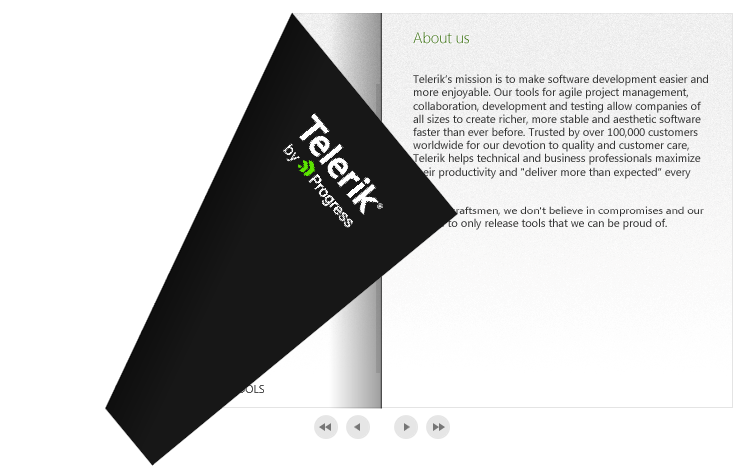

# Overview








Thank you for choosing Telerik __RadBook__!

## Key Features

* __Physical Book Experience__: Use animated flipping of pages or a [hard-cover]() effect to recreate the physical book experience.

* __Rich Digital Media Experience__: Create a rich digital media experience by using RadBook with a data source or define each page for a unique design and layout. Read more in the [Data Binding and Data Templates]() article.

* __Embed Any Content__: Easily embed any content into your book. RadBook supports text, media and images as well as any other {{ site.framework_name }} element.

* __Page Templates__: Use either left- or right-page templates for greater flexibility and ease of use when styling books or showing different types of content. You can also apply conditional templates using the [available template selector properties]().

>tip Get started with the control with its [Getting Started]() help article that shows how to use it in a basic scenario.

>Check out the online demos in the [UI for Silverlight Controls Examples](https://demos.telerik.com/silverlight/#ComboBox/FirstLook/)[UI for WPF Controls Examples](https://demos.telerik.com/wpf/) application.

## See Also

* [Visual Structure]()
* [Getting Started]()
