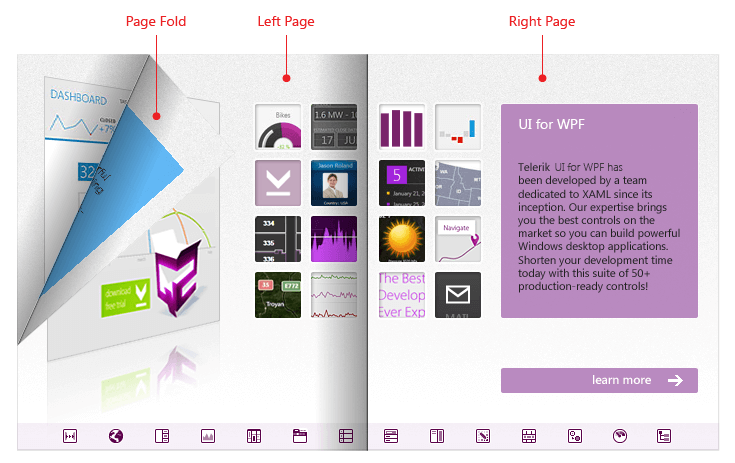
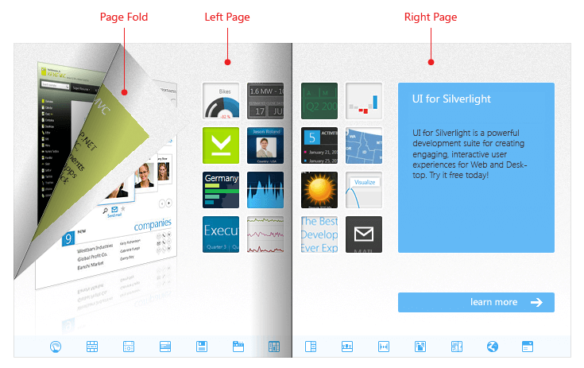

# Visual Structure








Thank you for choosing Telerik __RadBook__!

This section defines terms and concepts used in the scope of __RadBook__ you have to get familiar with prior to continue reading this help.

Below you can see a snapshot and explanation of the main visual elements of the __RadBook__ control.








The structure of a __RadBook__ consists of the following main elements:

* __Left Page__ -This is the page that is rendered on the left side of the book.	

* __Right Page__ -This is the page that is rendered on the right side of the book.

* __Page Fold__ - This is the part from the page that is dragged when the page is flipping.

## See Also
* [Getting Started]()