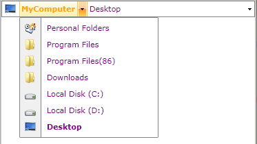

# Data Binding

The __RadBreacrumb__ provides extensive data binding support. You can  display flat data collections as well as hierarchical data. The following properties are exposed to help you implement data binding scenarios with the control:	  

* __IconPath__ - Gets or sets a path to a value on the source object to serve as the __BreadcrumbItem.Image__.		  

* __TextModePath__ - Gets or sets a path to a value on the source object to serve as the string representation of the __BreadcrumbItem__ in text mode		  

## Bind the Breadcrumb to a flat collection of business objects

The following example will show you how to bind a __Breadcrumb__ control to a flat collection of business objects. The final result should look like the snapshot below:



* First, you need to include the following assemblies in your XAML declaration:
	* __Telerik.Windows.Controls__	
	* __Telerik.Windows.Controls.Navigation__

* Create a new class named __ExplorerItem__ :

	__Example 1: Creating a model for the breadcrumb items__  
	```C#
		public class ExplorerItem
		{
			 public string Header { get; set; }
			 public string PreviewHeader { get; set; }
			 public string Path { get; set; }
			 public ImageSource IconPath { get; set;} 
		}
	```
	```VB.NET
		Public Class ExplorerItem
				Public Property Header() As String
						Get
								Return _Header
						End Get
						Set
								_Header = Value
						End Set
				End Property
				Private _Header As String
				Public Property PreviewHeader() As String
						Get
								Return _PreviewHeader
						End Get
						Set
								_PreviewHeader = Value
						End Set
				End Property
				Private _PreviewHeader As String
				Public Property Path() As String
						Get
								Return _Path
						End Get
						Set
								_Path = Value
						End Set
				End Property
				Private _Path As String
				Public Property IconPath() As ImageSource
						Get
								 Return _IconPath
						End Get
						Set
								 _IconPath = Value
						End Set
				End Property
				Private _IconPath As ImageSource
		End Class
	```

* Create a new class __MainViewModel__ - it will contain the collection of  __ExplorerItems__ that we will use as __ItemsSource__ for the __RadBreadcrumb__ as well as a __string__ property - __Header__

	__Example 2: Creating a main view model__  
	```C#
		public class MainViewModel
		{
		 public ObservableCollection<ExplorerItem> Items { get; set; }
		 public string Header { get; set; }
		 public MainViewModel()
		 {
		  ImageSourceConverter isc = new ImageSourceConverter();
		  this.Header = "MyComputer";
		  this.Items = new ObservableCollection<ExplorerItem>();
		  ExplorerItem personalInfo = new ExplorerItem()
		  {
		   Header = "Personal Folders",
		   IconPath = (ImageSource)isc.ConvertFromString("../../Images/1PersonalFolders.png"),
		   Path = "PersonalFolders"
		  };
		  this.Items.Add(personalInfo);
		  ExplorerItem programFiles = new ExplorerItem()
		  {
		   Header = "Program Files",
		   IconPath = (ImageSource)isc.ConvertFromString("../../Images/folder2.png"),
		   Path = "ProgramFiles"
		  };
		  this.Items.Add(programFiles);
		  ExplorerItem programFiles86 = new ExplorerItem()
		  {
		   Header = "Program Files(86)",
		   IconPath = (ImageSource)isc.ConvertFromString("../../Images/folder2.png"),
		   Path = "ProgramFiles(86)"
		  };
		  this.Items.Add(programFiles86);
		  ExplorerItem downloads = new ExplorerItem()
		  {
		   Header = "Downloads",
		   IconPath = (ImageSource)isc.ConvertFromString("../../Images/folder2.png"),
		   Path = "Downloads"
		  };
		  this.Items.Add(downloads);
		  ExplorerItem localHard = new ExplorerItem()
		  {
		   Header = "Local Disk (C:)",
		   Path = "LocalDisk(C:)",
		   IconPath = (ImageSource)isc.ConvertFromString("../../Images/HardDrive16.png")
		  };
		  this.Items.Add(localHard);
		  ExplorerItem localHard2 = new ExplorerItem()
		  {
		   Header = "Local Disk (D:)",
		   Path = "LocalDisk(D:)",
		   IconPath = (ImageSource)isc.ConvertFromString("../../Images/HardDrive16.png")
		  };
		  this.Items.Add(localHard2);
		  ExplorerItem desktop = new ExplorerItem()
		  {
		   Header = "Desktop",
		   Path = "Desktop",
		   IconPath = (ImageSource)isc.ConvertFromString("../../Images/Desktop.png")
		  };
		  this.Items.Add(desktop);
		 }
		}
	```
	```VB.NET
		Public Class MainViewModel
			Public Property Items() As ObservableCollection(Of ExplorerItem)
				Get
					Return m_Items
				End Get
				Set
					m_Items = Value
				End Set
			End Property
			Private m_Items As ObservableCollection(Of ExplorerItem)
			Public Property Header() As String
				Get
					Return m_Header
				End Get
				Set
					m_Header = Value
				End Set
			End Property
			Private m_Header As String
		
			Public Sub New()
				Dim isc As New ImageSourceConverter()
				Me.Header = "MyComputer"
				Me.Items = New ObservableCollection(Of ExplorerItem)()
		
				Dim personalInfo As New ExplorerItem() With { _
					Key .Header = "Personal Folders", _
					Key .IconPath = DirectCast(isc.ConvertFromString("../../Images/1PersonalFolders.png"), ImageSource), _
					Key .Path = "PersonalFolders" _
				}
				Me.Items.Add(personalInfo)
		
				Dim programFiles As New ExplorerItem() With { _
					Key .Header = "Program Files", _
					Key .IconPath = DirectCast(isc.ConvertFromString("../../Images/folder2.png"), ImageSource), _
					Key .Path = "ProgramFiles" _
				}
				Me.Items.Add(programFiles)
		
				Dim programFiles86 As New ExplorerItem() With { _
					Key .Header = "Program Files(86)", _
					Key .IconPath = DirectCast(isc.ConvertFromString("../../Images/folder2.png"), ImageSource), _
					Key .Path = "ProgramFiles(86)" _
				}
				Me.Items.Add(programFiles86)
		
				Dim downloads As New ExplorerItem() With { _
					Key .Header = "Downloads", _
					Key .IconPath = DirectCast(isc.ConvertFromString("../../Images/folder2.png"), ImageSource), _
					Key .Path = "Downloads" _
				}
				Me.Items.Add(downloads)
		
				Dim localHard As New ExplorerItem() With { _
					Key .Header = "Local Disk (C:)", _
					Key .Path = "LocalDisk(C:)", _
					Key .IconPath = DirectCast(isc.ConvertFromString("../../Images/HardDrive16.png"), ImageSource) _
				}
				Me.Items.Add(localHard)
		
				Dim localHard2 As New ExplorerItem() With { _
					Key .Header = "Local Disk (D:)", _
					Key .Path = "LocalDisk(D:)", _
					Key .IconPath = DirectCast(isc.ConvertFromString("../../Images/HardDrive16.png"), ImageSource) _
				}
				Me.Items.Add(localHard2)
		
				Dim desktop As New ExplorerItem() With { _
					Key .Header = "Desktop", _
					Key .Path = "Desktop", _
					Key .IconPath = DirectCast(isc.ConvertFromString("../../Images/Desktop.png"), ImageSource) _
				}
				Me.Items.Add(desktop)
			End Sub
		End Class
	```

* Use the __MainViewModel__ as data context for a __RadBreadcrumb__ control:			

	__Example 3: Setting up the DataContex of the breadcrumb__  
	```XAML
		<FrameworkElement.DataContext>
		    <vm:MainViewModel />
		</FrameworkElement.DataContext>
		<Grid Background="White">
		    <telerik:RadBreadcrumb VerticalAlignment="Top" ItemsSource="{Binding Items}" Header="{Binding}" TextModePath="Path" ImagePath="IconPath" IsIconVisible="True">
		        <telerik:RadBreadcrumb.HeaderTemplate>
		            <DataTemplate>
		                <TextBlock FontWeight="Bold" Foreground="Orange" Text="{Binding Header}" />
		            </DataTemplate>
		        </telerik:RadBreadcrumb.HeaderTemplate>
		        <telerik:RadBreadcrumb.ItemTemplate>
		            <DataTemplate>
		                <TextBlock Foreground="Purple" Text="{Binding Header}" />
		            </DataTemplate>
		        </telerik:RadBreadcrumb.ItemTemplate>
		    </telerik:RadBreadcrumb>
		</Grid>
	```

##  Display hierarchical data in the Breadcrumb control

* Extend the __ExplorerItem__ by adding a collection of __ExplorerItems__.  		

	__Example 4: Extending the breadcrumb items' model__  
	```C#
		public class ExplorerItem
		{
		 public string Header { get; set; }
		 public string PreviewHeader { get; set; }
		 public string Path { get; set; }
		 public ImageSource IconPath { get; set; }
		 public ObservableCollection<ExplorerItem> Children { get; set; }
		 public ExplorerItem()
		 {
		  this.Children = new ObservableCollection<ExplorerItem>();
		 }
		}
	```
	```VB.NET
		Public Class ExplorerItem
			Public Property Header() As String
				Get
					Return m_Header
				End Get
				Set
					m_Header = Value
				End Set
			End Property
			Private m_Header As String
			Public Property PreviewHeader() As String
				Get
					Return m_PreviewHeader
				End Get
				Set
					m_PreviewHeader = Value
				End Set
			End Property
			Private m_PreviewHeader As String
			Public Property Path() As String
				Get
					Return m_Path
				End Get
				Set
					m_Path = Value
				End Set
			End Property
			Private m_Path As String
			Public Property IconPath() As ImageSource
				Get
					Return m_IconPath
				End Get
				Set
					m_IconPath = Value
				End Set
			End Property
			Private m_IconPath As ImageSource
		
			Public Property Children() As ObservableCollection(Of ExplorerItem)
				Get
					Return m_Children
				End Get
				Set
					m_Children = Value
				End Set
			End Property
			Private m_Children As ObservableCollection(Of ExplorerItem)
		
			Public Sub New()
				Me.Children = New ObservableCollection(Of ExplorerItem)()
			End Sub
		End Class
	```

* Create a __MainViewModel__ class to define a hierarchical data collection of __ExplorerItems__:

	__Example 5: Creating the main view model__  
	```C#
		public class MainViewModel
		{
		 public ObservableCollection<ExplorerItem> Items { get; set; }
		 public ExplorerItem Root { get; set; }
		 public MainViewModel()
		 {
		  this.Items = new ObservableCollection<ExplorerItem>();
		  this.LoadItems();
		 }
		 public void LoadItems()
		 {
		  ImageSourceConverter isc = new ImageSourceConverter();
		  ExplorerItem personalInfo = new ExplorerItem()
		  {
		   Header = "Personal Folders",
		   IconPath = (ImageSource)isc.ConvertFromString("../../Images/1PersonalFolders.png"),
		   Children = new ObservableCollection<ExplorerItem>() 
		   {
			new ExplorerItem() {Header = "Deleted Items(6)", IconPath =  (ImageSource)isc.ConvertFromString("../../Images/2DeletedItems.png"), Path = "DeletedItems"},
			new ExplorerItem() {Header = "Drafts", IconPath =  (ImageSource)isc.ConvertFromString("../../Images/3Drafts.png"), Path = "Drafts"},
			new ExplorerItem() {Header = "Inbox(14)", IconPath =  (ImageSource)isc.ConvertFromString("../../Images/4Inbox.png"), Path = "Inbox",
				 Children = new ObservableCollection<ExplorerItem>()
				 {
				  new ExplorerItem() {Header = "Folders", IconPath =  (ImageSource)isc.ConvertFromString("../../Images/folder.png"), Path = "Folders"},
				 }
				},
			new ExplorerItem() {Header = "Junk E-mails", IconPath = (ImageSource)isc.ConvertFromString("../../Images/junk.png"), Path = "JunkEmails"},
			new ExplorerItem() {Header = "Outbox", IconPath =  (ImageSource)isc.ConvertFromString("../../Images/outbox.png"), Path = "Outbox"},
			new ExplorerItem() {Header = "Sent Items", IconPath =  (ImageSource)isc.ConvertFromString("../../Images/sent.png"), Path = "SentItems"},
			new ExplorerItem() {Header = "Search Folder", IconPath =  (ImageSource)isc.ConvertFromString("../../Images/searchFolder.png"), Path = "SearchFolder",
				 Children = new ObservableCollection<ExplorerItem>()
				 {
				  new ExplorerItem() {Header = "From Follow up", IconPath =  (ImageSource)isc.ConvertFromString("../../Images/search.png"), Path = "FromFollowup"},
				  new ExplorerItem() {Header = "Large Mail", IconPath =  (ImageSource)isc.ConvertFromString("../../Images/search.png"), Path = "LargeMail"},
				  new ExplorerItem() {Header = "Unread Mail", IconPath =  (ImageSource)isc.ConvertFromString("../../Images/search.png"), Path = "UnreadMail"},
				 }
				}
		   },
		   Path = "PersonalFolders"
		  };
		  ExplorerItem programFiles = new ExplorerItem()
		  {
		   Header = "Program Files",
		   IconPath = (ImageSource)isc.ConvertFromString("../../Images/folder2.png"),
		   Children = new ObservableCollection<ExplorerItem>()
		   {
			new ExplorerItem() { Header = "Microsoft", IconPath =  (ImageSource)isc.ConvertFromString("../../Images/folder.png"), Path = "Microsoft" },
			new ExplorerItem() { Header = "Microsoft.NET", IconPath =  (ImageSource)isc.ConvertFromString("../../Images/folder.png"), Path = "Microsoft.NET" },
			new ExplorerItem()
			{
			 Header = "Internet Explorer",
			 IconPath =  (ImageSource)isc.ConvertFromString("../../Images/folder2.png"),
			 Path = "InternetExplorer",
			 Children = new ObservableCollection<ExplorerItem>(){
						   new ExplorerItem() {Header = "SIGNUP", IconPath =  (ImageSource)isc.ConvertFromString("../../Images/folder.png"), Path = "SIGNUP"}
						  }
			}
		   },
		   Path = "ProgramFiles"
		  };
		  ExplorerItem programFiles86 = new ExplorerItem()
		  {
		   Header = "Program Files(86)",
		   IconPath = (ImageSource)isc.ConvertFromString("../../Images/folder2.png"),
		   Children = new ObservableCollection<ExplorerItem>()
		   {
			new ExplorerItem() { Header = "Microsoft", IconPath =  (ImageSource)isc.ConvertFromString("../../Images/folder.png"), Path = "Microsoft" },
			new ExplorerItem() { Header = "Microsoft.NET", IconPath =  (ImageSource)isc.ConvertFromString("../../Images/folder.png"), Path = "Microsoft.NET" },
			new ExplorerItem()
			{
			 Header = "Skype",
			 IconPath =  (ImageSource)isc.ConvertFromString("../../Images/folder2.png"),
			 Path = "Skype",
			 Children = new ObservableCollection<ExplorerItem>(){
						   new ExplorerItem() {Header = "Phone", IconPath =  (ImageSource)isc.ConvertFromString("../../Images/folder.png"), Path = "Phone"},
						   new ExplorerItem() {Header = "Toolbars", IconPath =  (ImageSource)isc.ConvertFromString("../../Images/folder.png"), Path = "Toolbars"},
						   new ExplorerItem() {Header = "Plugin Manager", IconPath =  (ImageSource)isc.ConvertFromString("../../Images/folder.png"), Path = "PluginManager"}
						  }
			},
			new ExplorerItem()
			{
			 Header = "Notepad++",
			 IconPath =  (ImageSource)isc.ConvertFromString("../../Images/folder2.png"),
			 Path = "Notepad++",
			 Children = new ObservableCollection<ExplorerItem>(){
						   new ExplorerItem() {Header = "localization", IconPath =  (ImageSource)isc.ConvertFromString("../../Images/folder.png"), Path = "localization"},
						   new ExplorerItem() {Header = "plugins", IconPath = (ImageSource)isc.ConvertFromString("../../Images/junk.png"), Path = "plugins"}
						  }
			}
		   },
		   Path = "ProgramFiles(86)"
		  };
		  ExplorerItem downloads = new ExplorerItem()
		  {
		   Header = "Downloads",
		   IconPath = (ImageSource)isc.ConvertFromString("../../Images/folder2.png"),
		   Children = new ObservableCollection<ExplorerItem>()
		   {
			new ExplorerItem() { Header = "Music", IconPath =  (ImageSource)isc.ConvertFromString("../../Images/folder.png"), Path = "Music" },
			new ExplorerItem() { Header = "Movies", IconPath =  (ImageSource)isc.ConvertFromString("../../Images/folder.png"), Path = "Movies" }
		   },
		   Path = "Downloads"
		  };
		  ExplorerItem localHard = new ExplorerItem()
		  {
		   Header = "Local Disk (C:)",
		   Path = "LocalDisk(C:)",
		   IconPath = (ImageSource)isc.ConvertFromString("../../Images/HardDrive16.png"),
		   Children = new ObservableCollection<ExplorerItem>()
		   {
			personalInfo,
			programFiles,
			programFiles86,
			downloads
		   }
		  };
		  ExplorerItem localHard2 = new ExplorerItem()
		  {
		   Header = "Local Disk (D:)",
		   Path = "LocalDisk(D:)",
		   IconPath = (ImageSource)isc.ConvertFromString("../../Images/HardDrive16.png")
		  };
		  ExplorerItem computer = new ExplorerItem()
		  {
		   Header = "Computer",
		   Path = "Computer",
		   IconPath = (ImageSource)isc.ConvertFromString("../../Images/Computer.png"),
		   Children = new ObservableCollection<ExplorerItem>()
		   {
			localHard,
			localHard2
		   }
		  };
		  ExplorerItem computer2 = new ExplorerItem()
		  {
		   Header = "Computer2",
		   Path = "Computer2",
		   Children = new ObservableCollection<ExplorerItem>()
		   {
			localHard,
			localHard2
		   }
		  };
		  this.Root = new ExplorerItem()
		  {
		   Header = "Desktop",
		   Path = "Desktop",
		   IconPath = (ImageSource)isc.ConvertFromString("../../Images/Desktop.png"),
		   Children = new ObservableCollection<ExplorerItem>()
		   {
			computer,
			computer2
		   }
		  };
		  this.Items = new ObservableCollection<ExplorerItem>() { this.Root };
		 }
		}
	```
	```VB.NET
		Public Class MainViewModel
			Public Property Items() As ObservableCollection(Of ExplorerItem)
				Get
					Return m_Items
				End Get
				Set
					m_Items = Value
				End Set
			End Property
			Private m_Items As ObservableCollection(Of ExplorerItem)
			Public Property Root() As ExplorerItem
				Get
					Return m_Root
				End Get
				Set
					m_Root = Value
				End Set
			End Property
			Private m_Root As ExplorerItem
		
			Public Sub New()
				Me.Items = New ObservableCollection(Of ExplorerItem)()
		
				Me.LoadItems()
			End Sub
			Public Sub LoadItems()
				Dim isc As New ImageSourceConverter()
				Dim personalInfo As New ExplorerItem() With { _
					Key .Header = "Personal Folders", _
					Key .IconPath = DirectCast(isc.ConvertFromString("../../Images/1PersonalFolders.png"), ImageSource), _
					Key .Children = New ObservableCollection(Of ExplorerItem)() From { _
						New ExplorerItem() With { _
							Key .Header = "Deleted Items(6)", _
							Key .IconPath = DirectCast(isc.ConvertFromString("../../Images/2DeletedItems.png"), ImageSource), _
							Key .Path = "DeletedItems" _
						}, _
						New ExplorerItem() With { _
							Key .Header = "Drafts", _
							Key .IconPath = DirectCast(isc.ConvertFromString("../../Images/3Drafts.png"), ImageSource), _
							Key .Path = "Drafts" _
						}, _
						New ExplorerItem() With { _
							Key .Header = "Inbox(14)", _
							Key .IconPath = DirectCast(isc.ConvertFromString("../../Images/4Inbox.png"), ImageSource), _
							Key .Path = "Inbox", _
							Key .Children = New ObservableCollection(Of ExplorerItem)() From { _
								New ExplorerItem() With { _
									Key .Header = "Folders", _
									Key .IconPath = DirectCast(isc.ConvertFromString("../../Images/folder.png"), ImageSource), _
									Key .Path = "Folders" _
								} _
							} _
						}, _
						New ExplorerItem() With { _
							Key .Header = "Junk E-mails", _
							Key .IconPath = DirectCast(isc.ConvertFromString("../../Images/junk.png"), ImageSource), _
							Key .Path = "JunkEmails" _
						}, _
						New ExplorerItem() With { _
							Key .Header = "Outbox", _
							Key .IconPath = DirectCast(isc.ConvertFromString("../../Images/outbox.png"), ImageSource), _
							Key .Path = "Outbox" _
						}, _
						New ExplorerItem() With { _
							Key .Header = "Sent Items", _
							Key .IconPath = DirectCast(isc.ConvertFromString("../../Images/sent.png"), ImageSource), _
							Key .Path = "SentItems" _
						}, _
						New ExplorerItem() With { _
							Key .Header = "Search Folder", _
							Key .IconPath = DirectCast(isc.ConvertFromString("../../Images/searchFolder.png"), ImageSource), _
							Key .Path = "SearchFolder", _
							Key .Children = New ObservableCollection(Of ExplorerItem)() From { _
								New ExplorerItem() With { _
									Key .Header = "From Follow up", _
									Key .IconPath = DirectCast(isc.ConvertFromString("../../Images/search.png"), ImageSource), _
									Key .Path = "FromFollowup" _
								}, _
								New ExplorerItem() With { _
									Key .Header = "Large Mail", _
									Key .IconPath = DirectCast(isc.ConvertFromString("../../Images/search.png"), ImageSource), _
									Key .Path = "LargeMail" _
								}, _
								New ExplorerItem() With { _
									Key .Header = "Unread Mail", _
									Key .IconPath = DirectCast(isc.ConvertFromString("../../Images/search.png"), ImageSource), _
									Key .Path = "UnreadMail" _
								} _
							} _
						} _
					}, _
					Key .Path = "PersonalFolders" _
				}
		
				Dim programFiles As New ExplorerItem() With { _
					Key .Header = "Program Files", _
					Key .IconPath = DirectCast(isc.ConvertFromString("../../Images/folder2.png"), ImageSource), _
					Key .Children = New ObservableCollection(Of ExplorerItem)() From { _
						New ExplorerItem() With { _
							Key .Header = "Microsoft", _
							Key .IconPath = DirectCast(isc.ConvertFromString("../../Images/folder.png"), ImageSource), _
							Key .Path = "Microsoft" _
						}, _
						New ExplorerItem() With { _
							Key .Header = "Microsoft.NET", _
							Key .IconPath = DirectCast(isc.ConvertFromString("../../Images/folder.png"), ImageSource), _
							Key .Path = "Microsoft.NET" _
						}, _
						New ExplorerItem() With { _
							Key .Header = "Internet Explorer", _
							Key .IconPath = DirectCast(isc.ConvertFromString("../../Images/folder2.png"), ImageSource), _
							Key .Path = "InternetExplorer", _
							Key .Children = New ObservableCollection(Of ExplorerItem)() From { _
								New ExplorerItem() With { _
									Key .Header = "SIGNUP", _
									Key .IconPath = DirectCast(isc.ConvertFromString("../../Images/folder.png"), ImageSource), _
									Key .Path = "SIGNUP" _
								} _
							} _
						} _
					}, _
					Key .Path = "ProgramFiles" _
				}
		
				Dim programFiles86 As New ExplorerItem() With { _
					Key .Header = "Program Files(86)", _
					Key .IconPath = DirectCast(isc.ConvertFromString("../../Images/folder2.png"), ImageSource), _
					Key .Children = New ObservableCollection(Of ExplorerItem)() From { _
						New ExplorerItem() With { _
							Key .Header = "Microsoft", _
							Key .IconPath = DirectCast(isc.ConvertFromString("../../Images/folder.png"), ImageSource), _
							Key .Path = "Microsoft" _
						}, _
						New ExplorerItem() With { _
							Key .Header = "Microsoft.NET", _
							Key .IconPath = DirectCast(isc.ConvertFromString("../../Images/folder.png"), ImageSource), _
							Key .Path = "Microsoft.NET" _
						}, _
						New ExplorerItem() With { _
							Key .Header = "Skype", _
							Key .IconPath = DirectCast(isc.ConvertFromString("../../Images/folder2.png"), ImageSource), _
							Key .Path = "Skype", _
							Key .Children = New ObservableCollection(Of ExplorerItem)() From { _
								New ExplorerItem() With { _
									Key .Header = "Phone", _
									Key .IconPath = DirectCast(isc.ConvertFromString("../../Images/folder.png"), ImageSource), _
									Key .Path = "Phone" _
								}, _
								New ExplorerItem() With { _
									Key .Header = "Toolbars", _
									Key .IconPath = DirectCast(isc.ConvertFromString("../../Images/folder.png"), ImageSource), _
									Key .Path = "Toolbars" _
								}, _
								New ExplorerItem() With { _
									Key .Header = "Plugin Manager", _
									Key .IconPath = DirectCast(isc.ConvertFromString("../../Images/folder.png"), ImageSource), _
									Key .Path = "PluginManager" _
								} _
							} _
						}, _
						New ExplorerItem() With { _
							Key .Header = "Notepad++", _
							Key .IconPath = DirectCast(isc.ConvertFromString("../../Images/folder2.png"), ImageSource), _
							Key .Path = "Notepad++", _
							Key .Children = New ObservableCollection(Of ExplorerItem)() From { _
								New ExplorerItem() With { _
									Key .Header = "localization", _
									Key .IconPath = DirectCast(isc.ConvertFromString("../../Images/folder.png"), ImageSource), _
									Key .Path = "localization" _
								}, _
								New ExplorerItem() With { _
									Key .Header = "plugins", _
									Key .IconPath = DirectCast(isc.ConvertFromString("../../Images/junk.png"), ImageSource), _
									Key .Path = "plugins" _
								} _
							} _
						} _
					}, _
					Key .Path = "ProgramFiles(86)" _
				}
		
				Dim downloads As New ExplorerItem() With { _
					Key .Header = "Downloads", _
					Key .IconPath = DirectCast(isc.ConvertFromString("../../Images/folder2.png"), ImageSource), _
					Key .Children = New ObservableCollection(Of ExplorerItem)() From { _
						New ExplorerItem() With { _
							Key .Header = "Music", _
							Key .IconPath = DirectCast(isc.ConvertFromString("../../Images/folder.png"), ImageSource), _
							Key .Path = "Music" _
						}, _
						New ExplorerItem() With { _
							Key .Header = "Movies", _
							Key .IconPath = DirectCast(isc.ConvertFromString("../../Images/folder.png"), ImageSource), _
							Key .Path = "Movies" _
						} _
					}, _
					Key .Path = "Downloads" _
				}
		
				Dim localHard As New ExplorerItem() With { _
					Key .Header = "Local Disk (C:)", _
					Key .Path = "LocalDisk(C:)", _
					Key .IconPath = DirectCast(isc.ConvertFromString("../../Images/HardDrive16.png"), ImageSource), _
					Key .Children = New ObservableCollection(Of ExplorerItem)() From { _
						personalInfo, _
						programFiles, _
						programFiles86, _
						downloads _
					} _
				}
		
				Dim localHard2 As New ExplorerItem() With { _
					Key .Header = "Local Disk (D:)", _
					Key .Path = "LocalDisk(D:)", _
					Key .IconPath = DirectCast(isc.ConvertFromString("../../Images/HardDrive16.png"), ImageSource) _
				}
		
				Dim computer As New ExplorerItem() With { _
					Key .Header = "Computer", _
					Key .Path = "Computer", _
					Key .IconPath = DirectCast(isc.ConvertFromString("../../Images/Computer.png"), ImageSource), _
					Key .Children = New ObservableCollection(Of ExplorerItem)() From { _
						localHard, _
						localHard2 _
					} _
				}
		
				Dim computer2 As New ExplorerItem() With { _
					Key .Header = "Computer2", _
					Key .Path = "Computer2", _
					Key .Children = New ObservableCollection(Of ExplorerItem)() From { _
						localHard, _
						localHard2 _
					} _
				}
		
				Me.Root = New ExplorerItem() With { _
					Key .Header = "Desktop", _
					Key .Path = "Desktop", _
					Key .IconPath = DirectCast(isc.ConvertFromString("../../Images/Desktop.png"), ImageSource), _
					Key .Children = New ObservableCollection(Of ExplorerItem)() From { _
						computer, _
						computer2 _
					} _
				}
		
				Me.Items = New ObservableCollection(Of ExplorerItem)() From { _
					Me.Root _
				}
			End Sub
		End Class
	```

* Display the hierarchical data collection in the __RadBreadcrumb__ control using:			

	* __HierarchicalDataTemplates__:		
		__Example 6: Using HierarchicalDataTemplates__  
		```XAML
			<FrameworkElement.DataContext>
			    <vm:MainViewModel />
			</FrameworkElement.DataContext>
			<Grid Background="White">
			    <telerik:RadBreadcrumb VerticalAlignment="Top" 
			                            Header="{Binding Root}"
			                            ImagePath="IconPath"
			                            IsIconVisible="True"
			                            ItemsSource="{Binding Root.Children}"
			                            TextModePath="Path">
			        <telerik:RadBreadcrumb.HeaderTemplate>
			            <DataTemplate>
			                <TextBlock Text="{Binding Header}" />
			            </DataTemplate>
			        </telerik:RadBreadcrumb.HeaderTemplate>
			        <telerik:RadBreadcrumb.ItemTemplate>
			            <HierarchicalDataTemplate ItemsSource="{Binding Children}">
			                <HierarchicalDataTemplate.ItemTemplate>
			                    <DataTemplate>
			                        <TextBlock Text="{Binding Header}" />
			                    </DataTemplate>
			                </HierarchicalDataTemplate.ItemTemplate>
			                <TextBlock Text="{Binding Header}" />
			            </HierarchicalDataTemplate>
			        </telerik:RadBreadcrumb.ItemTemplate>
			    </telerik:RadBreadcrumb>
			</Grid>
		```

	* the __Breadcrumb__ properties exposed to facilitate your efforts in populating the control with hierarchical data:
		* __HeaderMemberPath__ - Gets or sets a path to a value on the source object to serve as the __BreadcrumbItem.Header__.							

		* __HierarchicalItemsSource__ - Gets or sets a path to a value on the source object to serve as the __BreadcrumbItem__ 's __ItemsSource__ collection.							

		* __HierarchicalMemberPath__ - Gets or sets a path to a value on the source object to serve as the __BreadcrumbItem.DropDownHeader__.							

			__Example 7: Using HierarchicalMemberPath__  
			```XAML
				<telerik:RadBreadcrumb VerticalAlignment="Top"
									   Header="{Binding Root}"
									   HeaderMemberPath="Header"
									   HierarchicalItemsSource="Children"
									   HierarchicalMemberPath="Header"
									   ImagePath="IconPath"
									   IsIconVisible="True"
									   ItemsSource="{Binding Root.Children}"
									   TextModePath="Path" />
			```

In both approaches the final result should look like this:


## See Also
 * [Visual Structure]()
 * [Getting Started]()
 * [Features Overview]()