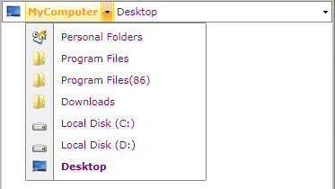
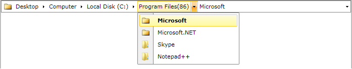

# Data Binding

The __RadBreacrumb__ provides extensive data binding support. You can  display flat data collections as well as hierarchical data. The following properties are exposed to help you implement data binding scenarios with the control:	  

* __IconPath__ - Gets or sets a path to a value on the source object to serve as the __BreadcrumbItem.Image__.		  

* __TextModePath__ - Gets or sets a path to a value on the source object to serve as the string representation of the __BreadcrumbItem__ in text mode		  

## Bind the Breadcrumb to a flat collection of business objects

The following example will show you how to bind a __Breadcrumb__ control to a flat collection of business objects. The final result should look like the snapshot below:

* First, you need to include the following assemblies in your XAML declaration:
	* __Telerik.Windows.Controls__	
	* __Telerik.Windows.Controls.Navigation__

* Create a new class named __ExplorerItem__ :

	__Example 1: Creating a model for the breadcrumb items__  
	<snippet id='radbreadcrumb-features-databinding-block_1-cs' />
	<snippet id='radbreadcrumb-features-databinding-block_1-vb' />

* Create a new class __MainViewModel__ - it will contain the collection of  __ExplorerItems__ that we will use as __ItemsSource__ for the __RadBreadcrumb__ as well as a __string__ property - __Header__

	__Example 2: Creating a main view model__  
	<snippet id='radbreadcrumb-features-databinding-block_2-cs' />
	<snippet id='radbreadcrumb-features-databinding-block_2-vb' />

* Use the __MainViewModel__ as data context for a __RadBreadcrumb__ control:			

	__Example 3: Setting up the DataContex of the breadcrumb__  
	<snippet id='radbreadcrumb-features-databinding-block_3-xaml' />

##  Display hierarchical data in the Breadcrumb control

* Extend the __ExplorerItem__ by adding a collection of __ExplorerItems__.  		

	__Example 4: Extending the breadcrumb items' model__  
	<snippet id='radbreadcrumb-features-databinding-block_4-cs' />
	<snippet id='radbreadcrumb-features-databinding-block_4-vb' />

* Create a __MainViewModel__ class to define a hierarchical data collection of __ExplorerItems__:

	__Example 5: Creating the main view model__  
	<snippet id='radbreadcrumb-features-databinding-block_5-cs' />
	<snippet id='radbreadcrumb-features-databinding-block_5-vb' />

* Display the hierarchical data collection in the __RadBreadcrumb__ control using:			

	* __HierarchicalDataTemplates__:		
	__Example 6: Using HierarchicalDataTemplates__  
	<snippet id='radbreadcrumb-features-databinding-block_6-xaml' />

	* The __Breadcrumb__ properties exposed to facilitate your efforts in populating the control with hierarchical data:
		* __HeaderMemberPath__ - Gets or sets a path to a value on the source object to serve as the __BreadcrumbItem.Header__.							

		* __HierarchicalItemsSource__ - Gets or sets a path to a value on the source object to serve as the __BreadcrumbItem__ 's __ItemsSource__ collection.							

		* __HierarchicalMemberPath__ - Gets or sets a path to a value on the source object to serve as the __BreadcrumbItem.DropDownHeader__.							

			__Example 7: Using HierarchicalMemberPath__  
			<snippet id='radbreadcrumb-features-databinding-block_7-xaml' />

In both approaches the final result should look like this:

## See Also
 * [Visual Structure]()
 * [Getting Started]()
 * [Features Overview]()
