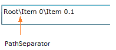
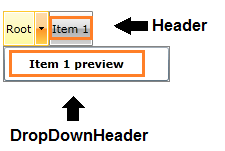
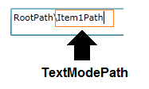
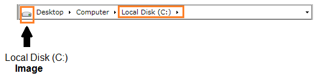

# Overview

The __RadBreadcrumb__ and __RadBreacrumbItem__ controls expose a set of properties to allow further customization of their behavior and layout:

## RadBreadcrumb common properties

* __Header__- gets/sets the root element of the __Breadcrumb__ control

* __CurrentItem__- is of type object and gets the current destination data item

* __CurrentContainer__ - is of type __RadBreadcrumbBarItem__ and gets the current destination __RadBreadcrumbItem__

* __Path__ - gets/sets a destination target path

* __PathSeparator__ - gets/sets the path separator symbol

* __IsLinearMode__- is of type bool and controls whether the __Breadcrumb__ is in __Linear__ mode. By default this property is __False__ .

* __IsIconVisible__- is of type bool and controls whether the __Breadcrumb.Image__ should be displayed. By default this property is __False__ .

* __IsTextModeEnabled__- is of type bool and controls whether the __Breadcrumb.TextMode__ is enabled. By default this property is __True__ .

* __IsHistoryEnabled__- is of type bool and specifies whether history of visited paths should be kept. By default this property is __True__ .

>tipEven if the __IsHistoryEnabled__ property is set to False, you can add items to the RadBreadcrumb.HistoryItems collection. You can use this collection to create a set of favorites for example.

## RadBreadcrumbItem common properties

* __Header__ - gets/sets the __Header__ of the __BreadcrumbItem__

* __DropDownHeader__ - gets/sets the __Header__ of the __BreadcrumbItem__ that is used to visualize the item when displayed inside its parent's __DropDown__ content

* __TextModePath__ - gets/sets the string representation of the __BreadcrumbItem__ in text mode

* __Image__ - is of type __ImageSource__ and allows setting an __ImageSource__ for the __BreadcrumbItem.Image__

# See Also

 * [Visual Structure]()

 * [Getting Started]()

 * [Databinding ]()
