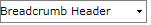
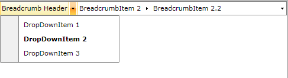
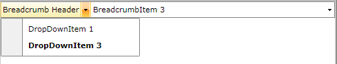
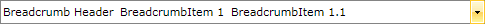

# Getting Started with {{ site.framework_name }} Breadcrumb

This tutorial will walk you through the creation of a __RadBreadcrumb__.	  

## Adding Telerik Assemblies Using NuGet

To use __RadBreadcrumb__ when working with NuGet packages, install the `Telerik.Windows.Controls.Navigation.for.Wpf.Xaml` package. The [package name may vary]() slightly based on the Telerik dlls set - [Xaml or NoXaml]()

Read more about NuGet installation in the [Installing UI for WPF from NuGet Package]() article.

>tip With the 2025 Q1 release, the Telerik UI for WPF has a new licensing mechanism. You can learn more about it [here]().

## Adding Assembly References Manually

If you are not using NuGet packages, you can add a reference to the following assemblies:

* __Telerik.Licensing.Runtime__
* __Telerik.Windows.Controls__
* __Telerik.Windows.Controls.Navigation__
* __Telerik.Windows.Data__ 

You can find the required assemblies for each control from the suite in the [Controls Dependencies]()[Controls Dependencies]() help article.

##  Define a Breadcrumb control

__Example 1__ demonstrates a basic __RadBreadcrumb__ definition.  

__Example 1: Defining a RadBreadcrumb in XAML__  
```XAML
	<telerik:RadBreadcrumb x:Name="breadcrumb" Header="Breadcrumb Header" HorizontalAlignment="Stretch" VerticalAlignment="Top"/>
```

__Example 2: Defining a RadBreadcrumb in code__  
```C#
	RadBreadcrumb breadcrumb = new RadBreadcrumb();
	breadcrumb.Header = "Breadcrumb Header";
	breadcrumb.HorizontalAlignment = System.Windows.HorizontalAlignment.Stretch;
	breadcrumb.VerticalAlignment = System.Windows.VerticalAlignment.Top;
```
```VB.NET
	Dim breadcrumb As New RadBreadcrumb()
	breadcrumb.Header = "Breadcrumb Header"
	breadcrumb.HorizontalAlignment = System.Windows.HorizontalAlignment.Stretch
	breadcrumb.VerticalAlignment = System.Windows.VerticalAlignment.Top
```



>The __RadBreacrumb__ control is a __HeaderedItemsControl__ and its Header is used as a root element. Therefore the control always has one root element. If you don't set the __Breadcrumb.Header__ property an empty root element will be created.		  

So far there is an empty __RadBreadcrumb__ containing no items.		

## Add and remove items (RadBreadcrumbItem controls) and set their Header and DropDownHeader properties

You can add items to the __RadBreadcrumb__ control by defining __RadBreadcrumbItem__ controls inside the __RadBreadcrumb__ definition in XAML:		

__Example 3: Adding RadBreadcrumbItems in XAML__  
```XAML
	<telerik:RadBreadcrumb Header="Breadcrumb Header" HorizontalAlignment="Stretch" VerticalAlignment="Top">
	    <telerik:RadBreadcrumbItem Header="BreadcrumbItem 1" DropDownHeader="DropDownItem 1">
	        <telerik:RadBreadcrumbItem Header="BreadcrumbItem 1.1" DropDownHeader="DropDownItem 1.1"/>
	        <telerik:RadBreadcrumbItem Header="BreadcrumbItem 1.2" DropDownHeader="DropDownItem 1.2" />
	        <telerik:RadBreadcrumbItem Header="BreadcrumbItem 1.3" DropDownHeader="DropDownItem 1.3" />
	    </telerik:RadBreadcrumbItem>
	    <telerik:RadBreadcrumbItem Header="BreadcrumbItem 2" DropDownHeader="DropDownItem 2">
	        <telerik:RadBreadcrumbItem Header="BreadcrumbItem 2.1" DropDownHeader="DropDownItem 2.1" />
	        <telerik:RadBreadcrumbItem Header="BreadcrumbItem 2.2" DropDownHeader="DropDownItem 2.2" />
	        <telerik:RadBreadcrumbItem Header="BreadcrumbItem 2.3" DropDownHeader="DropDownItem 2.3" />
	    </telerik:RadBreadcrumbItem>
	    <telerik:RadBreadcrumbItem Header="BreadcrumbItem 3" DropDownHeader="DropDownItem 3" />
	</telerik:RadBreadcrumb>
```

Or you can populate the __RadBreadcrumb.Items__ collection in code-behind:

__Example 4: Adding RadBreadcrumbItems in code__  
```C#
	RadBreadcrumbItem item1 = new RadBreadcrumbItem() { Header = "BreadcrumbItem 1", DropDownHeader = "DropDownItem 1" };
	item1.Items.Add(new RadBreadcrumbItem() { Header = "BreadcrumbItem 1.1", DropDownHeader = "DropDownItem 1.1" });
	item1.Items.Add(new RadBreadcrumbItem() { Header = "BreadcrumbItem 1.2", DropDownHeader = "DropDownItem 1.2" });
	item1.Items.Add(new RadBreadcrumbItem() { Header = "BreadcrumbItem 1.3", DropDownHeader = "DropDownItem 1.3" });
	breadcrumb.Items.Add(item1);
	RadBreadcrumbItem item2 = new RadBreadcrumbItem() { Header = "BreadcrumbItem 2", DropDownHeader = "DropDownItem 2" };
	item2.Items.Add(new RadBreadcrumbItem() { Header = "BreadcrumbItem 2.1", DropDownHeader = "DropDownItem 2.1" });
	item2.Items.Add(new RadBreadcrumbItem() { Header = "BreadcrumbItem 2.2", DropDownHeader = "DropDownItem 2.2" });
	item2.Items.Add(new RadBreadcrumbItem() { Header = "BreadcrumbItem 2.3", DropDownHeader = "DropDownItem 2.3" });
	breadcrumb.Items.Add(item2);
	RadBreadcrumbItem item3 = new RadBreadcrumbItem() { Header = "BreadcrumbItem 3", DropDownHeader = "DropDownItem 3" };
	breadcrumb.Items.Add(item3);
```
```VB.NET
	Dim item1 As New RadBreadcrumbItem() With { 
	        Key .Header = "BreadcrumbItem 1", 
	        Key .DropDownHeader = "DropDownItem 1" 
	}
	item1.Items.Add(New RadBreadcrumbItem() With { 
	        Key .Header = "BreadcrumbItem 1.1", 
	        Key .DropDownHeader = "DropDownItem 1.1" 
	})
	item1.Items.Add(New RadBreadcrumbItem() With { 
	        Key .Header = "BreadcrumbItem 1.2", 
	        Key .DropDownHeader = "DropDownItem 1.2" 
	})
	item1.Items.Add(New RadBreadcrumbItem() With { 
	        Key .Header = "BreadcrumbItem 1.3", 
	        Key .DropDownHeader = "DropDownItem 1.3" 
	})
	breadcrumb.Items.Add(item1)
	
	Dim item2 As New RadBreadcrumbItem() With { 
	        Key .Header = "BreadcrumbItem 2", 
	        Key .DropDownHeader = "DropDownItem 2" 
	}
	item2.Items.Add(New RadBreadcrumbItem() With { 
	        Key .Header = "BreadcrumbItem 2.1", 
	        Key .DropDownHeader = "DropDownItem 2.1" 
	})
	item2.Items.Add(New RadBreadcrumbItem() With { 
	        Key .Header = "BreadcrumbItem 2.2", 
	        Key .DropDownHeader = "DropDownItem 2.2" 
	})
	item2.Items.Add(New RadBreadcrumbItem() With { 
	        Key .Header = "BreadcrumbItem 2.3", 
	        Key .DropDownHeader = "DropDownItem 2.3" 
	})
	breadcrumb.Items.Add(item2)
	
	Dim item3 As New RadBreadcrumbItem() With { 
	        Key .Header = "BreadcrumbItem 3", 
	        Key .DropDownHeader = "DropDownItem 3" 
	}
	breadcrumb.Items.Add(item3)
```



In order to remove items from the __RadBreadcrumb__ control, you can remove them from the control's __Items__ collection:

__Example 5: Removing RadBreadcrumbItems__  
```C#
	breadcrumb.Items.Remove(item2);
```
```VB.NET
	breadcrumb.Items.Remove(item2)
```



## Enable LinearMode

By default the __RadBreadcrumb__ control has two modes - normal and text mode. In the normal mode you can navigate through the __Breadcrumb.Items__ using the BreadcrumbItems and their dropdown content, while in the text mode you can enter the path that you want to navigate to. The control also provides a __Linear__ mode in which the __BreadcrumbItem DropDown Items__ collection is hidden. In __Linear__ mode you can navigate through the __Items__ collection of the control by taking advantage of the text mode of the __RadBreadcrumb__, using its history, using the key navigation or setting the destination path from code-behind.

In order to enable the __Linear__ mode of the __RadBreadcrumb__ control, you have to set the __IsLinearMode__ property to __True__ :

__Example 6: Enabling linear mode in XAML__  
```XAML
	<telerik:RadBreadcrumb  Header="Breadcrumb Header" HorizontalAlignment="Stretch"
	        VerticalAlignment="Top" IsLinearMode="True">
	    <telerik:RadBreadcrumbItem Header="BreadcrumbItem 1" DropDownHeader="DropDownItem 1">
	        <telerik:RadBreadcrumbItem Header="BreadcrumbItem 1.1" DropDownHeader="DropDownItem 1.1" />
	        <telerik:RadBreadcrumbItem Header="BreadcrumbItem 1.2" DropDownHeader="DropDownItem 1.2" />
	        <telerik:RadBreadcrumbItem Header="BreadcrumbItem 1.3" DropDownHeader="DropDownItem 1.3" />
	    </telerik:RadBreadcrumbItem>
	    <telerik:RadBreadcrumbItem Header="BreadcrumbItem 2" DropDownHeader="DropDownItem 2">
	        <telerik:RadBreadcrumbItem Header="BreadcrumbItem 2.1" DropDownHeader="DropDownItem 2.1" />
	        <telerik:RadBreadcrumbItem Header="BreadcrumbItem 2.2" DropDownHeader="DropDownItem 2.2" />
	        <telerik:RadBreadcrumbItem Header="BreadcrumbItem 2.3" DropDownHeader="DropDownItem 2.3" />
	    </telerik:RadBreadcrumbItem>
	    <telerik:RadBreadcrumbItem Header="BreadcrumbItem 3" DropDownHeader="DropDownItem 3" />
	</telerik:RadBreadcrumb>
```

__Example 7: Enabling linear mode in code__  
```C#
	breadcrumb.IsLinearMode = true;
```
```VB.NET
	breadcrumb.IsLinearMode = True
```



## Change the number of paths saved in the Breadcrumb history

By default the __RadBreadcrumb__ control keeps a history of 10 visited paths. If you want to increase or decrease this number, you can set the __HistorySize__ property:		

__Example 8: Setting the history size in XAML__  
```XAML
	<telerik:RadBreadcrumb Header="Breadcrumb Header" HorizontalAlignment="Stretch"
	        VerticalAlignment="Top" HistorySize="15">
	    ...
	</telerik:RadBreadcrumb>
```

__Example 9: Setting the history size in code__  
```C#
	breadcrumb.HistorySize = 15;
```
```VB.NET
	breadcrumb.HistorySize = 15
```

## Setting a Theme

The controls from our suite support different themes. You can see how to apply a theme different than the default one in the [Setting a Theme]() help article.

>important Changing the theme using implicit styles will affect all controls that have styles defined in the merged resource dictionaries. This is applicable only for the controls in the scope in which the resources are merged. 

To change the theme, you can follow the steps below:

* Choose between the themes and add reference to the corresponding theme assembly (ex: **Telerik.Windows.Themes.Fluent.dll**). You can see the different themes applied in the **Theming** examples from our [WPF Controls Examples](https://demos.telerik.com/wpf/)[Silverlight Controls Examples](https://demos.telerik.com/silverlight/#Breadcrumb/Theming) application.

* Merge the ResourceDictionaries with the namespace required for the controls that you are using from the theme assembly. For the __RadBreadcrumb__, you will need to merge the following resources:

	* __Telerik.Windows.Controls__
	* __Telerik.Windows.Controls.Navigation__

__Example 2__ demonstrates how to merge the ResourceDictionaries so that they are applied globally for the entire application.

__Example 2: Merge the ResourceDictionaries__  
```XAML
	<Application.Resources>
		<ResourceDictionary>
			<ResourceDictionary.MergedDictionaries>
				<ResourceDictionary Source="/Telerik.Windows.Themes.Fluent;component/Themes/System.Windows.xaml"/>
				<ResourceDictionary Source="/Telerik.Windows.Themes.Fluent;component/Themes/Telerik.Windows.Controls.xaml"/>
				<ResourceDictionary Source="/Telerik.Windows.Themes.Fluent;component/Themes/Telerik.Windows.Controls.Navigation.xaml"/>
			</ResourceDictionary.MergedDictionaries>
		</ResourceDictionary>
	</Application.Resources>
```

>Alternatively, you can use the theme of the control via the [StyleManager](https://docs.telerik.com/devtools/wpf/styling-and-appearance/stylemanager/common-styling-apperance-setting-theme-wpf)[StyleManager](https://docs.telerik.com/devtools/silverlight/styling-and-appearance/stylemanager/common-styling-apperance-setting-theme).

__Figure 2__ shows a __RadBreadcrumb__ with the **Fluent** theme applied.
	
#### __Figure 2: RadBreadcrumb with the Fluent theme__



## Telerik UI for WPF Learning Resources

* [Telerik UI for WPF Breadcrumb Component](https://www.telerik.com/products/wpf/breadcrumb.aspx)
* [Getting Started with Telerik UI for WPF Components]()
* [Telerik UI for WPF Installation]()
* [Telerik UI for WPF and WinForms Integration]()
* [Telerik UI for WPF Visual Studio Templates]()
* [Setting a Theme with Telerik UI for WPF]()
* [Telerik UI for WPF Virtual Classroom (Training Courses for Registered Users)](https://learn.telerik.com/learn/course/external/view/elearning/16/telerik-ui-for-wpf) 
* [Telerik UI for WPF License Agreement](https://www.telerik.com/purchase/license-agreement/wpf-dlw-s)


## See Also  
 * [Overview]()
 * [Features Overview]()
