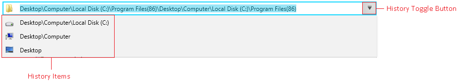

# History Support

The history feature allows you to keep track of the items that were selected in the breadcrumb. Each time an item gets unselected it gets on top of the history stack.

The history tracking is enabled by default. To disable it, set the `IsHistoryEnabled` property of `RadBreadcrumb` to `false`.

#### __[XAML] Disabling the history feature__
{{region radbreadcrumb-history-0}}
	<telerik:RadBreadcrumb IsHistoryEnabled="False"/>
{{endregion}}

The drop down area where the history items appear can be toggled manually via the `IsHistoryOpen` property of `RadBreadcrumb`. The property can be used also to get the current state of the drop down.

To access the history items, use the `HistoryItems` collection property of `RadBreadcrumb`. The collection contains `RadBreadcrumbBarItem` objects.

#### __[C#] Getting history items__
{{region radbreadcrumb-history-1}}
	var historyItem = this.breadcrumb.HistoryItems[0] as RadBreadcrumbBarItem;
{{endregion}}

By default the history stores up to 10 items. To change this, set the `HistorySize` property of `RadBreadcrumb`.

#### __[XAML] Changing the history size__
{{region radbreadcrumb-history-2}}
	<telerik:RadBreadcrumb HistorySize="20"/>
{{endregion}}

## See Also  
 * [Getting Started]()
 * [Features]()
