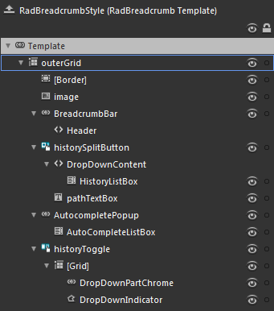

# Templates Structure

Like most SilverlightWPF controls, the __RadBreadcrumb__ also allows you to template it in order to change the control from the inside. Except for templating the whole control, you can template parts of it or even independent controls related to it. This topic will make you familiar with the __RadBreadcrumb__ Template Structure
			

>tipFor more information about templating and how to modify the default templates of the RadControls read [the common topics](http://www.telerik.com/help/silverlight/common-styling-appearance-edit-control-templates-blend.html)[the common topics](http://www.telerik.com/help/wpf/common-styling-appearance-edit-control-templates-blend.html) on this matter.
				

## RadBreadcrumb Template Structure

This section will explain the structure of the __RadBreadcrumb__'s template. Here is a snapshot of the template generated in Expression Blend.
				

It contains the following parts:

* __outerGrid__ - is of type __Grid__ and represents the layout root for the template.
						
* __[Border]__ - hosts the __RadBreadcrumb__control elements and is of type __Border__.
							
* __image__ - is of type __Image__ and represents the __BreadcrumbItems Image__.

* __BreadcrumbBar__ - that is a mandatory element from the __RadBreadcrumb__ template used to display the __Breadcrumb__ items and is of type __RadBreadcrumbBar__.

* __historySplitButton__ - a __RadSplitButton__ that is used to display the __History__ dropdown content.
								
* __HistoryListBox__ - a __ListBox__ that represents the list of visited paths.
									
* __pathTextBox__ - the __TextBox__, where destination paths are entered.
									
* __AutocompletePopup__ - is a Telerik popup that is used to provide auto-complete options.
								
* __AutoCompleteListBox__ - is a __ListBox__ that represents the list of auto-complete suggestions.
									
* __historyToggle__ - a __RadToggleButton__ that is used to display the __History ToggleButton__.

* __[Grid]__ - represents the host control for the __History ToggleButton__.
										
* __DropDownPartChrome__ - represents the visual appearance of the __historyToggle__ button and is of type __ButtonChrome__.
											
* __DropDownIndicator__ - represents the arrow indicator for the drop down part of the __historyToggle__ button and is of type __Path__.
											